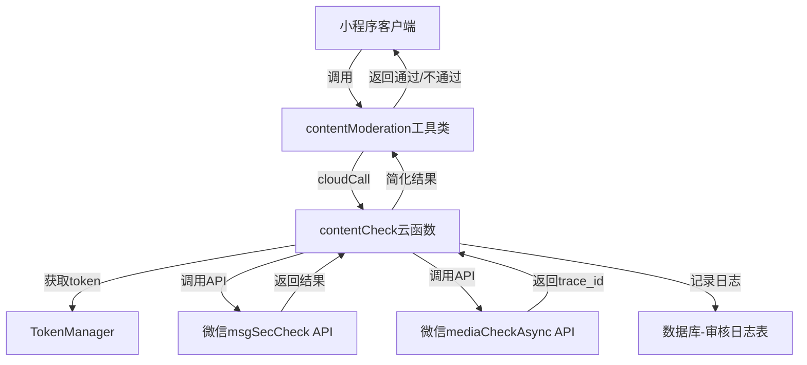

# Design Document

## Overview

微信内容审核组件是一个用于小程序端的内容安全检测工具，通过云函数调用微信官方内容安全API，实现文本和图片的自动审核。该组件采用客户端-云函数分离架构，客户端负责发起审核请求并接收简单的通过/不通过结果，云函数负责与微信API交互、管理access_token、处理错误并将详细审核信息记录到数据库。

## Architecture

系统采用三层架构：

1. **客户端层（MiniProgram）**：提供审核服务的调用接口，处理用户交互和加载状态
2. **云函数层（Cloud Functions）**：处理审核逻辑、token管理、API调用和数据持久化
3. **微信API层（WeChat API）**：提供内容安全检测能力



## Components and Interfaces

### 1. 客户端工具类：contentModeration.js

位置：`utils/contentModeration.js`

提供给小程序页面调用的审核接口。

```javascript
/**
 * 审核文本内容
 * @param {string} content - 要审核的文本内容
 * @param {object} options - 可选参数
 * @param {number} options.scene - 场景值（1-资料、2-评论、3-论坛、4-社交日志），默认2
 * @param {string} options.title - 文本标题
 * @param {string} options.nickname - 用户昵称
 * @returns {Promise<{passed: boolean, message: string}>}
 */
async function checkText(content, options = {})

/**
 * 审核图片内容
 * @param {string} imageUrl - 图片URL
 * @param {object} options - 可选参数
 * @param {number} options.scene - 场景值，默认2
 * @returns {Promise<{passed: boolean, message: string, traceId: string}>}
 */
async function checkImage(imageUrl, options = {})

/**
 * 批量审核内容（文本+图片）
 * @param {object} content - 内容对象
 * @param {string} content.text - 文本内容
 * @param {string[]} content.images - 图片URL数组
 * @param {object} options - 可选参数
 * @returns {Promise<{passed: boolean, message: string, failedType: string}>}
 */
async function checkContent(content, options = {})
```

### 2. 云函数：contentCheck

位置：`functions/contentCheck/index.js`

处理审核请求的云函数。

**输入参数：**
```javascript
{
  type: 'text' | 'image' | 'batch',  // 审核类型
  content: string,                    // 文本内容（type=text时）
  imageUrl: string,                   // 图片URL（type=image时）
  images: string[],                   // 图片URL数组（type=batch时）
  scene: number,                      // 场景值
  title: string,                      // 可选：标题
  nickname: string,                   // 可选：昵称
  openid: string                      // 用户openid（自动注入）
}
```

**返回结果：**
```javascript
{
  success: boolean,
  passed: boolean,        // 审核是否通过
  message: string,        // 提示信息
  traceId: string,        // 图片审核的trace_id
  failedType: string      // 批量审核时，失败的类型（text/image）
}
```

### 3. Token管理模块：TokenManager

位置：`functions/contentCheck/tokenManager.js`

管理微信access_token的获取、缓存和刷新。

```javascript
/**
 * 获取有效的access_token
 * @returns {Promise<string>}
 */
async function getAccessToken()

/**
 * 刷新access_token
 * @returns {Promise<string>}
 */
async function refreshAccessToken()

/**
 * 验证token是否有效
 * @param {string} token
 * @returns {Promise<boolean>}
 */
async function validateToken(token)
```

### 4. 微信API调用模块：WechatAPIClient

位置：`functions/contentCheck/wechatAPIClient.js`

封装微信内容安全API的调用。

```javascript
/**
 * 调用文本安全检测API
 * @param {string} accessToken
 * @param {object} params
 * @returns {Promise<object>}
 */
async function msgSecCheck(accessToken, params)

/**
 * 调用图片安全检测API
 * @param {string} accessToken
 * @param {object} params
 * @returns {Promise<object>}
 */
async function mediaCheckAsync(accessToken, params)
```

### 5. 审核日志记录模块：ModerationLogger

位置：`functions/contentCheck/moderationLogger.js`

将审核详情记录到数据库。

```javascript
/**
 * 记录审核日志
 * @param {object} logData
 * @returns {Promise<void>}
 */
async function logModeration(logData)
```

## Data Models

### 审核日志表（moderation_logs）

存储在云数据库中，记录所有审核请求的详细信息。

```javascript
{
  _id: string,              // 自动生成
  openid: string,           // 用户openid
  type: string,             // 审核类型：text/image
  content: string,          // 文本内容（脱敏处理，最多保存100字）
  imageUrl: string,         // 图片URL
  scene: number,            // 场景值
  result: {
    suggest: string,        // pass/risky/review
    label: number,          // 标签码
  },
  detail: array,            // 详细检测结果
  traceId: string,          // 图片审核trace_id
  passed: boolean,          // 是否通过
  errorCode: number,        // 错误码（如有）
  errorMessage: string,     // 错误信息（如有）
  createTime: date,         // 创建时间
  _openid: string          // 云数据库权限字段
}
```

### Token缓存表（access_tokens）

存储access_token及其过期时间。

```javascript
{
  _id: string,
  token: string,            // access_token
  expiresAt: date,          // 过期时间
  updateTime: date          // 更新时间
}
```

## 
Correctness Properties

*A property is a characteristic or behavior that should hold true across all valid executions of a system-essentially, a formal statement about what the system should do. Properties serve as the bridge between human-readable specifications and machine-verifiable correctness guarantees.*

Property 1: Valid text input returns valid result structure
*For any* valid text content (non-empty, ≤2500 characters), calling the text moderation service should return a result object with `passed` (boolean) and `message` (string) fields.
**Validates: Requirements 1.1**

Property 2: Valid image URL returns valid result structure
*For any* valid image URL with supported format, calling the image moderation service should return a result object with `passed`, `message`, and `traceId` fields.
**Validates: Requirements 2.1**

Property 3: Trace ID persistence
*For any* image moderation request that returns a trace_id, that trace_id should be stored and retrievable from the database.
**Validates: Requirements 2.4**

Property 4: Token injection
*For any* cloud function invocation, a valid access_token should be automatically obtained and included in the WeChat API request.
**Validates: Requirements 3.1**

Property 5: OpenID extraction
*For any* moderation service call from the mini-program, the user's openid should be automatically extracted from the context and included in the request.
**Validates: Requirements 3.3**

Property 6: UTF-8 encoding
*For any* text content containing special characters (emoji, Chinese characters, symbols), the cloud function should properly encode it as UTF-8 before sending to WeChat API.
**Validates: Requirements 3.5**

Property 7: Unknown error logging
*For any* error returned by WeChat API with an unrecognized error code, the service should log the complete error information and return a generic error message.
**Validates: Requirements 4.4**

Property 8: Error log completeness
*For any* error that occurs during moderation, the error log should contain timestamp, error code, and sanitized request parameters.
**Validates: Requirements 4.5**

Property 9: Scene parameter support
*For any* valid scene value (1, 2, 3, or 4), the moderation service should accept it and pass it to the WeChat API.
**Validates: Requirements 5.1**

Property 10: Optional parameters pass-through
*For any* moderation request with optional parameters (title, nickname), these parameters should be properly passed to the WeChat API.
**Validates: Requirements 5.5**

Property 11: Result structure consistency
*For any* completed moderation request (success or failure), the service should return an object with a consistent structure containing at minimum `passed` and `message` fields.
**Validates: Requirements 6.1**

Property 12: Failed moderation logging
*For any* moderation result where `suggest` is "risky" or "review", the complete details (label, keywords, confidence) should be recorded in the database.
**Validates: Requirements 6.4**

Property 13: Concurrent request independence
*For any* set of concurrent moderation requests, each request should complete independently without affecting the results of other requests.
**Validates: Requirements 7.3**

Property 14: Cache deduplication
*For any* identical content moderated within a 5-minute window, the second request should return the cached result without calling the WeChat API again.
**Validates: Requirements 7.4**

Property 15: Promise return type
*For any* moderation method call, the return value should be a Promise that resolves to the result object.
**Validates: Requirements 8.2**

Property 16: Callback invocation
*For any* moderation request with a callback function provided, the callback should be invoked with the moderation result upon completion.
**Validates: Requirements 8.4**

Property 17: Batch processing completeness
*For any* batch moderation request with multiple items, all items should be processed and the result should indicate which items passed or failed.
**Validates: Requirements 8.5**

## Error Handling

### Error Categories

1. **Input Validation Errors**
   - Empty or whitespace-only text
   - Text exceeding 2500 characters
   - Invalid or empty image URL
   - Unsupported image format
   - Invalid scene parameter
   - Missing openid

2. **WeChat API Errors**
   - System busy (errcode: -1) → Auto-retry up to 3 times
   - Invalid access_token (errcode: 40001) → Refresh token and retry
   - Invalid openid (errcode: 40003) → Return auth error
   - Invalid scene (errcode: 40129) → Return parameter error
   - Rate limit exceeded (errcode: 44991, 45009) → Return rate limit error
   - User session expired (errcode: 61010) → Return auth error

3. **Network Errors**
   - Request timeout → Return timeout error with retry suggestion
   - Connection failure → Return network error

4. **System Errors**
   - Database write failure → Log error but still return moderation result
   - Cache read/write failure → Fallback to direct API call

### Error Response Format

All errors returned to the client follow this structure:

```javascript
{
  success: false,
  passed: false,
  message: string,  // User-friendly error message in Chinese
  errorCode: string // Internal error code for debugging
}
```

### Error Messages (Chinese)

- `"内容不能为空"` - Empty content
- `"内容长度超过限制"` - Content too long
- `"图片地址无效"` - Invalid image URL
- `"图片格式不支持"` - Unsupported image format
- `"请先登录"` - Authentication required
- `"调用频率超限，请稍后再试"` - Rate limit exceeded
- `"网络超时，请重试"` - Network timeout
- `"系统繁忙，请稍后再试"` - System busy
- `"内容审核未通过"` - Content moderation failed (generic)

## Testing Strategy

### Unit Testing

Unit tests will cover:

1. **Input validation functions**
   - Test empty string rejection
   - Test whitespace-only string rejection
   - Test 2500 character boundary
   - Test invalid URL formats
   - Test unsupported image formats
   - Test invalid scene values

2. **Token management**
   - Test token retrieval from cache
   - Test token refresh when expired
   - Test token validation

3. **Result transformation**
   - Test mapping from WeChat API response to client response
   - Test error code mapping to user messages

4. **Database operations**
   - Test log record creation
   - Test cache read/write operations

### Property-Based Testing

We will use a property-based testing library appropriate for JavaScript/Node.js (such as fast-check) to verify the correctness properties defined above.

**Configuration:**
- Each property test should run a minimum of 100 iterations
- Each test must be tagged with a comment referencing the design document property
- Tag format: `// Feature: wechat-content-moderation, Property {number}: {property_text}`

**Test Generators:**

1. **Valid text generator**: Generates random strings of 1-2500 characters with various Unicode characters
2. **Valid URL generator**: Generates valid HTTP/HTTPS URLs with supported image extensions
3. **Scene value generator**: Generates values from [1, 2, 3, 4]
4. **Error response generator**: Generates various WeChat API error responses
5. **Concurrent request generator**: Generates arrays of moderation requests for concurrency testing

**Property Test Examples:**

```javascript
// Feature: wechat-content-moderation, Property 1: Valid text input returns valid result structure
test('valid text returns valid structure', async () => {
  await fc.assert(
    fc.asyncProperty(
      fc.string({ minLength: 1, maxLength: 2500 }),
      async (text) => {
        const result = await checkText(text);
        expect(result).toHaveProperty('passed');
        expect(result).toHaveProperty('message');
        expect(typeof result.passed).toBe('boolean');
        expect(typeof result.message).toBe('string');
      }
    ),
    { numRuns: 100 }
  );
});
```

### Integration Testing

Integration tests will verify:

1. End-to-end text moderation flow (client → cloud function → WeChat API → database)
2. End-to-end image moderation flow
3. Batch moderation with mixed content types
4. Token refresh flow when token expires
5. Error handling and retry mechanisms
6. Cache hit/miss scenarios

### Manual Testing Checklist

- [ ] Test with actual sensitive content to verify WeChat API integration
- [ ] Test rate limiting behavior by making rapid requests
- [ ] Verify database logs contain expected information
- [ ] Test on actual WeChat mini-program environment
- [ ] Verify UI displays appropriate error messages

## Performance Considerations

1. **Caching Strategy**
   - Cache moderation results for identical content (5-minute TTL)
   - Cache access_token (expires based on WeChat's expiry time)
   - Use in-memory cache for token, database for moderation results

2. **Timeout Configuration**
   - Text moderation: 3-second timeout
   - Image moderation: 5-second timeout
   - Database operations: 2-second timeout

3. **Retry Strategy**
   - System busy errors: Retry 3 times with exponential backoff (100ms, 200ms, 400ms)
   - Token refresh: Single retry after refresh
   - No retry for validation errors or rate limit errors

4. **Batch Optimization**
   - Process batch items in parallel using Promise.all()
   - Fail fast: Return immediately if any item fails (optional behavior)
   - Provide detailed failure information for each item

## Security Considerations

1. **Data Sanitization**
   - Truncate stored text content to 100 characters maximum
   - Remove sensitive information from error logs
   - Never log access_token or openid in plain text

2. **Access Control**
   - Verify openid matches the authenticated user
   - Use cloud database permissions to restrict log access
   - Validate all input parameters before processing

3. **Rate Limiting**
   - Implement client-side rate limiting to prevent abuse
   - Track per-user moderation request counts
   - Alert on suspicious patterns (e.g., 100+ requests in 1 minute)

## Deployment Notes

1. **Cloud Function Configuration**
   - Memory: 256MB
   - Timeout: 10 seconds
   - Environment variables: WECHAT_APPID, WECHAT_SECRET

2. **Database Indexes**
   - Create index on `moderation_logs.openid` for user query performance
   - Create index on `moderation_logs.createTime` for time-based queries
   - Create TTL index on cache collections (5-minute expiry)

3. **Monitoring**
   - Track moderation request volume
   - Monitor error rates by error code
   - Alert on rate limit errors
   - Track average response times

## Future Enhancements

1. **Async Image Result Polling**
   - Implement webhook receiver for async image moderation results
   - Provide polling API for checking image moderation status

2. **Advanced Caching**
   - Implement content fingerprinting for better cache hit rates
   - Use Redis for distributed caching in multi-instance deployments

3. **Analytics Dashboard**
   - Visualize moderation statistics
   - Track most common violation types
   - Monitor user-specific patterns

4. **Custom Keyword Filtering**
   - Allow administrators to add custom blocked keywords
   - Implement local pre-filtering before calling WeChat API
