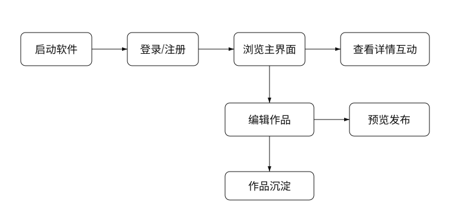
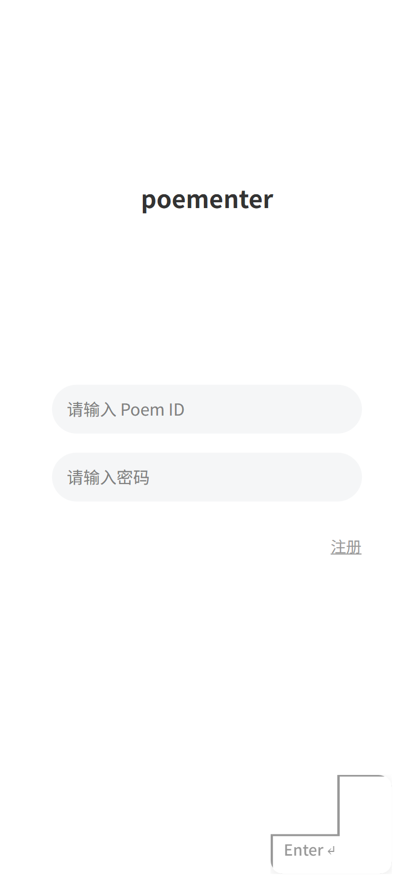
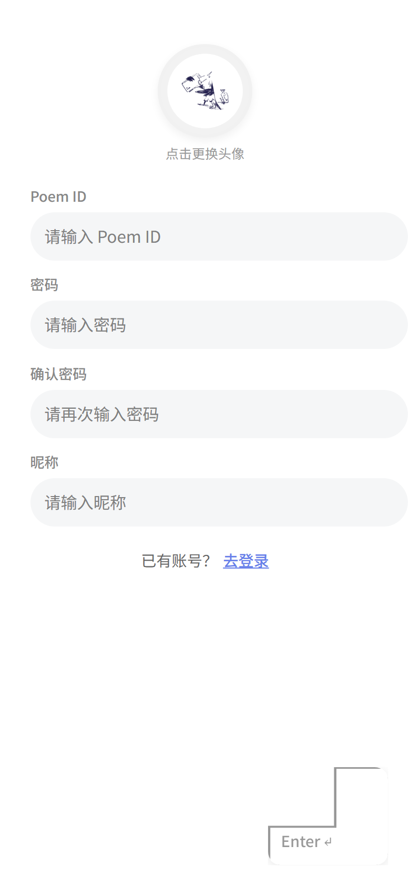
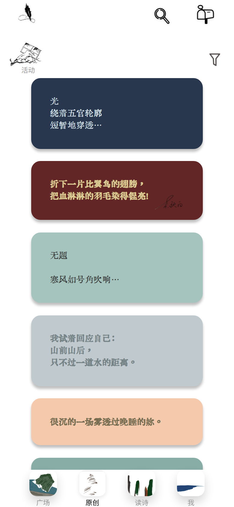
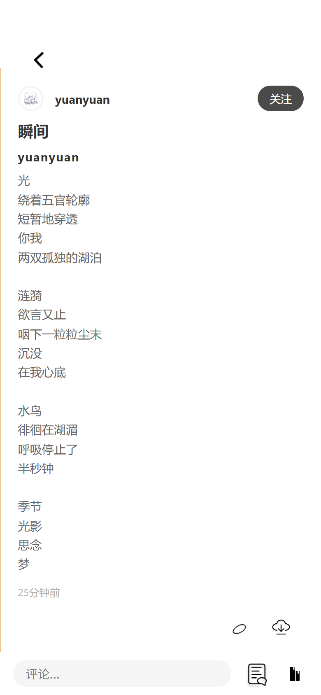
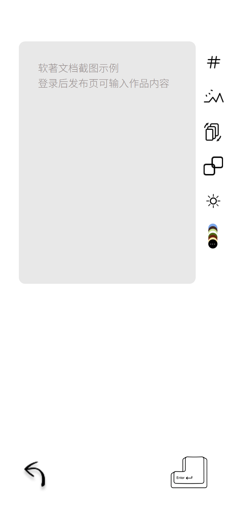
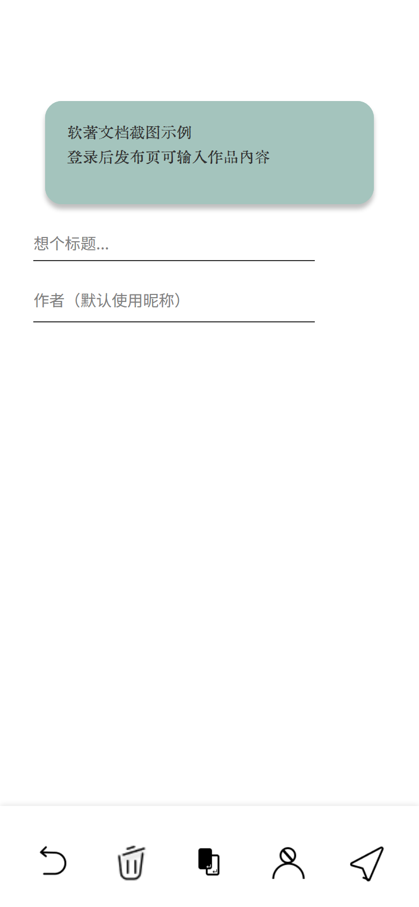
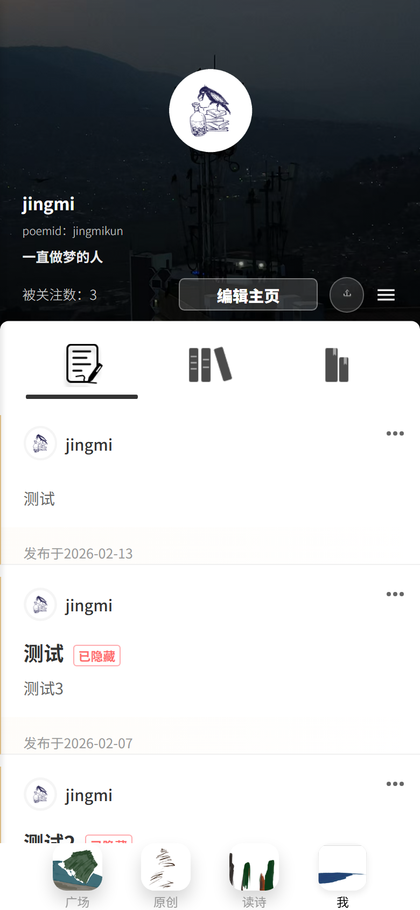
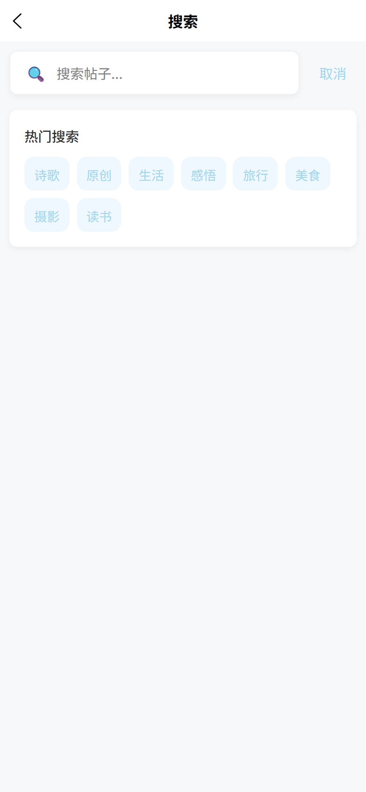

# 回车键Poementer软件操作手册

| 项目 | 内容 |
| --- | --- |
| 软件名称 | 回车键Poementer软件 |
| 文档名称 | 操作手册 |
| 文档版本 | V1.0 |
| 适用对象 | 普通用户、内容创作者、运营管理员、软件登记审查人员 |
| 适用端 | 微信小程序、H5、App |
| 编制日期 | 2026-04-26 |

## 1. 软件简介

回车键Poementer软件是一款面向诗歌创作、作品展示、评论互动、作品集沉淀与活动运营的多端软件。用户可以在软件内登录账号、浏览广场内容、查看原创诗歌、发布诗歌或讨论、参与点赞评论、维护个人资料、管理作品集与收藏夹。

本手册以普通用户完整使用流程为主线，覆盖“启动软件、登录注册、主界面浏览、作品详情互动、作品发布、个人中心管理、搜索与消息”等主要功能。截图为依据当前界面结构整理的清晰操作截图，用于展示功能入口、按钮位置和页面操作顺序。

## 2. 启动软件与进入首页

### 2.1 启动步骤

1. 在微信小程序、H5 地址或 App 图标中打开“回车键Poementer软件”。
2. 软件显示启动页，并执行字体、图片、缓存与登录态预加载。
3. 页面显示 Enter 进入按钮后，点击 Enter。
4. 如果本地存在有效登录态，软件进入主界面；如果没有有效账号，则进入登录页或允许浏览公开内容。

### 2.2 注意事项

| 情况 | 处理方式 |
| --- | --- |
| 首次使用 | 建议先注册账号，后续可跨端保存作品和互动记录 |
| 网络较慢 | 等待加载完成后重试，公开内容可在部分场景下继续浏览 |
| 重复打开 | 软件可能跳过启动动画，直接进入主页面 |

## 3. 登录与注册

### 3.1 使用 Poem ID 登录

1. 在登录页输入已注册的 Poem ID。
2. 在密码输入框输入账号密码。
3. 检查两个输入框均不为空。
4. 点击右下角 Enter 按钮提交登录。
5. 登录成功后，软件写入本地登录状态并跳转主界面。

### 3.2 使用微信或第三方登录

微信小程序端可使用微信授权登录；H5 或 App 可按已配置能力使用账号密码、GitHub OAuth 或手机号相关登录能力。第三方登录成功后，软件会绑定用户标识，并把用户资料、关注、作品和互动数据归入同一账号。

### 3.3 新用户注册

1. 在登录页点击“注册”进入注册页。
2. 可点击头像区域选择头像，也可以使用默认头像。
3. 依次填写 Poem ID、密码、确认密码、昵称。
4. 确认两次密码一致。
5. 点击右下角 Enter 完成注册。
6. 注册成功后进入主界面；如当前端要求绑定手机号，则按弹窗完成验证码绑定或选择稍后处理。

## 4. 主界面说明

### 4.1 主界面组成

| 区域 | 功能说明 |
| --- | --- |
| 顶部搜索入口 | 搜索作品、作者、标签和讨论内容 |
| 消息入口 | 查看点赞、评论、关注等消息通知 |
| 活动入口 | 查看近期活动和活动作品 |
| 筛选入口 | 对广场或原创列表进行内容类型筛选 |
| 内容列表 | 展示诗歌、讨论、拼贴诗等内容卡片 |
| 底部导航 | 在广场、原创、读诗、我之间切换 |

### 4.2 底部导航

| 导航项 | 操作结果 |
| --- | --- |
| 广场 | 查看推荐、关注、讨论等综合内容 |
| 原创 | 查看原创诗歌列表，支持筛选和进入发布 |
| 读诗 | 查看精选阅读内容、发现页和活动相关内容 |
| 我 | 进入个人中心，管理资料、作品、收藏和消息 |

## 5. 浏览作品与互动

### 5.1 浏览作品

1. 在主界面上下滑动浏览作品卡片。
2. 点击作品卡片进入详情页。
3. 详情页展示作者信息、完整作品内容、标签、评论区和操作按钮。
4. 点击作者头像或昵称可进入作者主页。

### 5.2 点赞、评论、收藏与分享

| 操作 | 步骤 | 结果 |
| --- | --- | --- |
| 点赞 | 点击作品下方 Like 或爱心按钮 | 页面即时显示点赞状态，服务端保存点赞记录 |
| 评论 | 点击评论入口，在输入框填写内容并提交 | 评论追加到作品详情页，并触发作者消息 |
| 收藏 | 点击 Favorite 或收藏入口，选择收藏夹 | 作品进入个人收藏夹，后续可在个人中心查看 |
| 分享 | 点击 Share 入口 | 按端能力生成分享链接、分享卡片或图片 |

### 5.3 未登录状态说明

未登录用户可浏览公开内容；当执行点赞、评论、收藏、关注、发布等需要身份的操作时，软件会提示用户先登录或注册。

## 6. 发布作品

### 6.1 进入发布页

1. 在原创、广场或相关页面点击发布入口。
2. 软件进入发布编辑页。
3. 在主输入区域填写诗歌、讨论或组诗内容。
4. 可通过右侧工具栏添加标签、上传图片、切换发布模式、选择高光或颜色。

### 6.2 编辑内容

| 功能 | 操作说明 |
| --- | --- |
| 输入正文 | 在编辑区直接输入诗歌、讨论文字或组诗段落 |
| 添加图片 | 点击图片工具，选择本地图片，软件上传至云存储 |
| 设置标签 | 点击标签工具，选择已有标签或输入自定义标签 |
| 切换模式 | 在诗歌、讨论、组诗等模式之间切换 |
| 设置样式 | 选择背景色、字体色或高光样式，用于作品卡片展示 |

### 6.3 预览与提交

1. 编辑完成后点击右下角下一步。
2. 在预览页检查排版、颜色、图片、标签和可见范围。
3. 选择作品集或收藏归档位置。
4. 如需要匿名发布，开启匿名选项。
5. 点击“发布”，软件执行内容审核、图片保存和帖子创建。
6. 发布成功后返回列表，作品进入广场或原创列表。

## 7. 个人中心与内容管理

### 7.1 个人资料

1. 点击底部导航“我”进入个人中心。
2. 查看头像、昵称、签名、作品数量、关注数量和粉丝数量。
3. 点击“编辑资料”修改头像、昵称、签名、Poem ID、密码或绑定信息。
4. 保存后返回个人中心，页面展示最新资料。

### 7.2 作品集、收藏和消息

| 功能 | 操作方式 |
| --- | --- |
| 作品集 | 进入作品集列表，新建文件夹或查看已发布作品 |
| 收藏夹 | 查看收藏作品，可按文件夹整理 |
| 我的点赞 | 查看已点赞过的作品 |
| 关注与粉丝 | 查看关注用户与粉丝列表，并可进入用户主页 |
| 消息中心 | 查看评论、点赞、关注、系统通知等消息 |
| 屏蔽用户 | 管理已屏蔽用户，减少不希望看到的内容 |

## 8. 搜索、标签与活动

### 8.1 搜索内容

1. 点击主界面顶部搜索入口。
2. 输入关键词，例如作品标题、诗句、作者昵称或标签。
3. 点击搜索或选择搜索建议。
4. 在结果列表中点击作品进入详情，或点击用户进入主页。
5. 搜索历史会保留常用关键词，可在搜索页再次使用。

### 8.2 标签筛选

1. 在作品卡片或发布页选择标签。
2. 点击标签进入标签筛选页。
3. 页面按标签展示相关作品。
4. 可继续进入作品详情、作者主页或参与互动。

### 8.3 活动功能

1. 点击主界面活动入口查看近期活动。
2. 进入活动详情页阅读活动说明、时间和参与规则。
3. 点击参与或发布入口，按活动模式发布作品。
4. 活动作品会归入对应活动列表，运营人员可在后台进行活动管理。

## 9. 管理端与异常处理

### 9.1 管理端主要能力

后台页面面向管理员开放，主要用于活动管理、活动作品管理、帖子审核、诗人资料维护、反馈列表查看和密码找回辅助。普通用户不会在主界面直接看到后台入口。

| 管理功能 | 功能说明 |
| --- | --- |
| 活动管理 | 新建、编辑、下架活动 |
| 活动帖子 | 查看活动参与作品，处理违规或异常内容 |
| 帖子管理 | 管理公开内容、处理删除和可见性 |
| 反馈管理 | 查看用户反馈，跟进问题 |
| 诗人管理 | 维护诗人信息和展示资料 |

### 9.2 常见异常处理

| 异常现象 | 处理建议 |
| --- | --- |
| 登录失败 | 检查 Poem ID 和密码；确认网络正常后重试 |
| 图片上传失败 | 更换网络或压缩图片后重新上传 |
| 发布失败 | 检查内容是否为空、图片是否上传完成、内容是否通过审核 |
| 列表加载慢 | 下拉刷新或重新进入页面；缓存会在后台更新 |
| 消息未及时刷新 | 进入消息页后下拉刷新，或重新打开软件 |

## 10. 完整操作流程示例

1. 用户打开软件，进入启动页并点击 Enter。
2. 输入 Poem ID 和密码完成登录；新用户先注册。
3. 在主界面浏览广场内容，点击作品进入详情。
4. 在详情页点赞、评论或收藏作品。
5. 返回原创页，点击发布入口进入编辑页。
6. 输入诗歌内容，设置标签和颜色，进入预览页。
7. 确认无误后发布作品。
8. 进入个人中心，在作品集中查看已发布作品，并在消息中心查看互动通知。

## 11. 文档交付说明

本操作手册与《回车键Poementer软件设计开发说明书》配套提交：操作手册用于证明软件可操作流程，设计开发说明书用于说明软件结构、功能模块、接口、流程、数据和运行设计。源程序提交稿另以 A4 竖版、白底黑字、每页 50 行、共 60 页方式生成。
