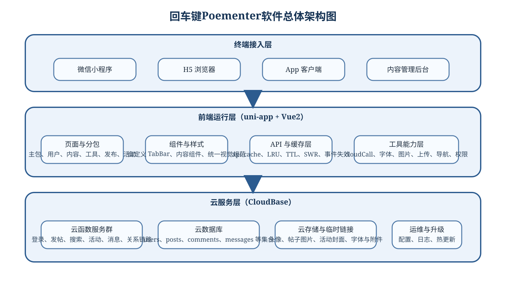
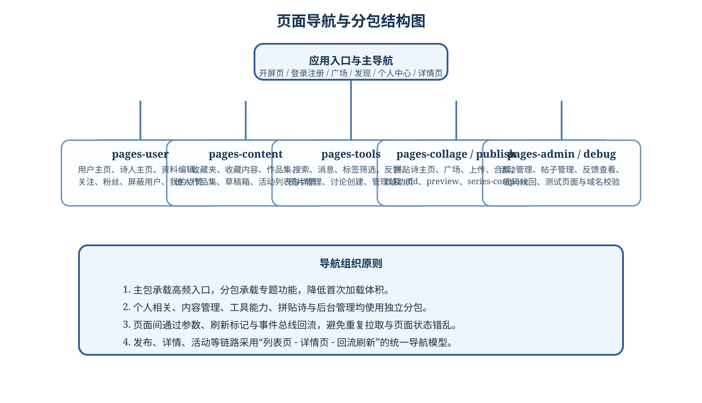
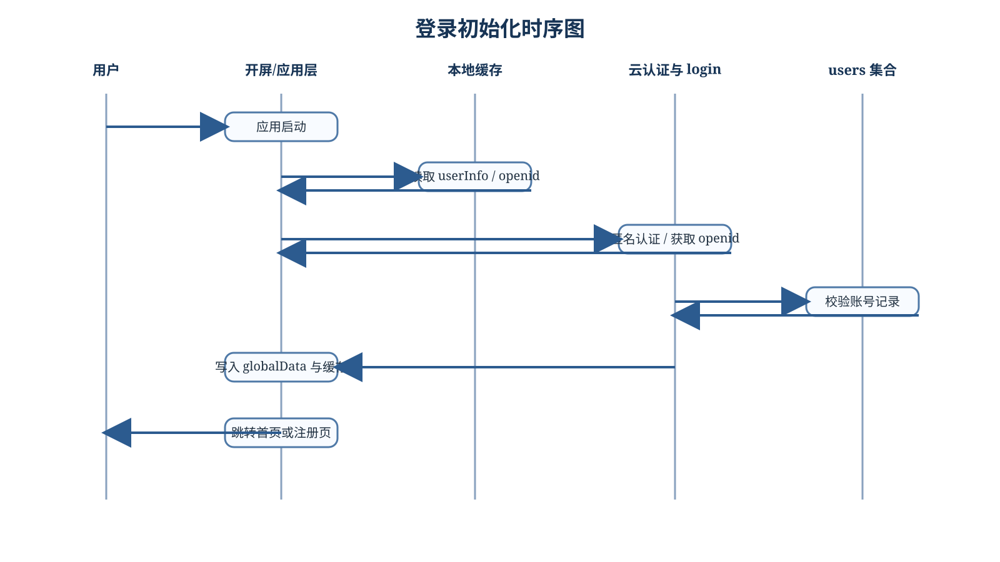
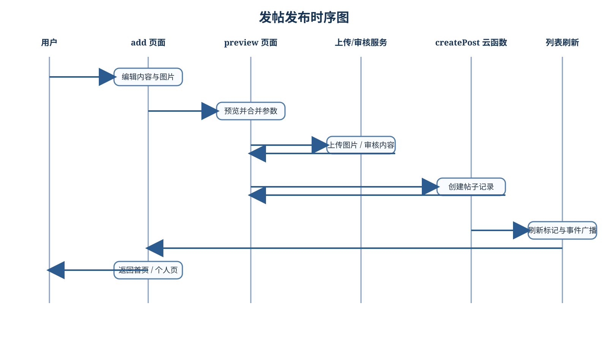
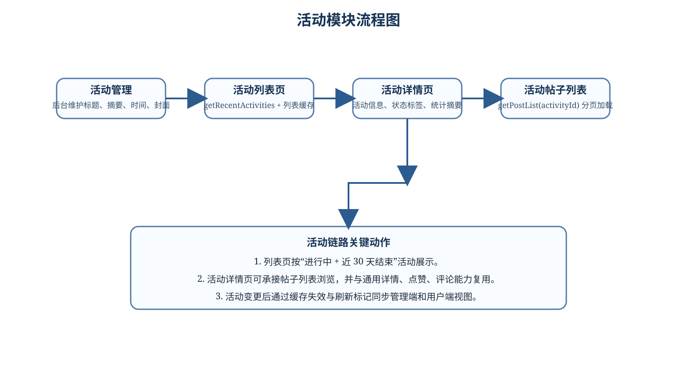
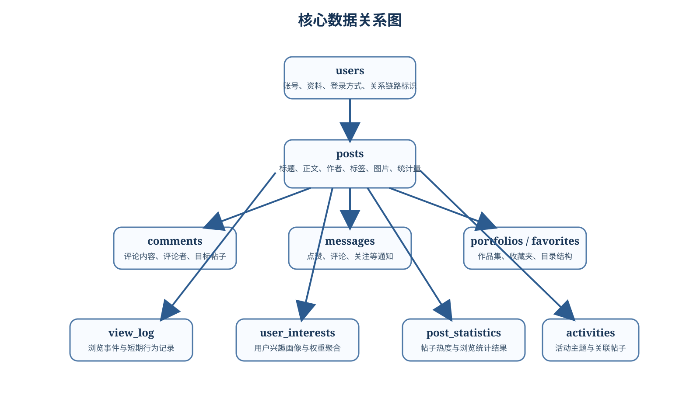
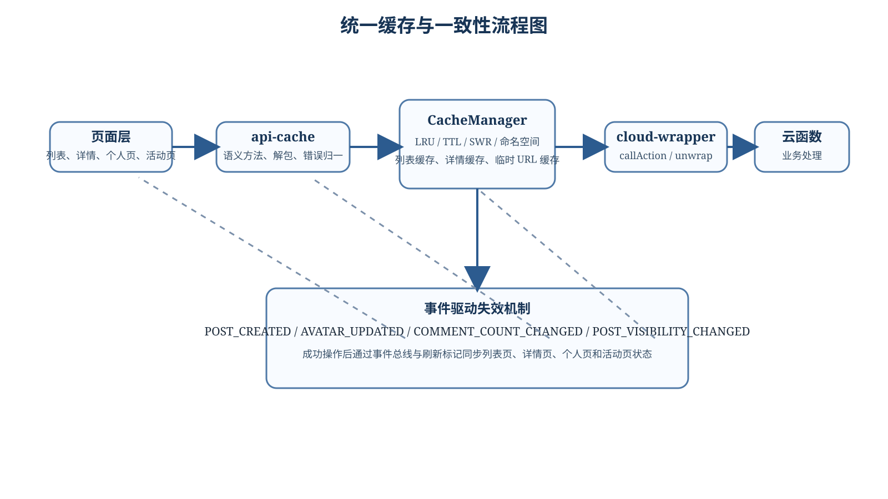
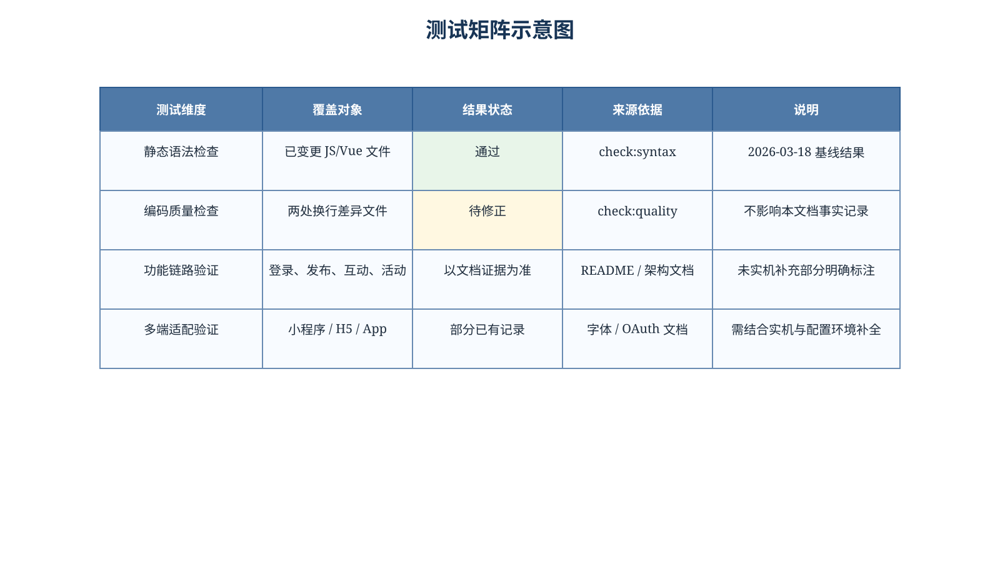

## 第01页 文档封面与基本信息

### 1.1 基本信息

| 项目 | 内容 |
| --- | --- |
| 软件名称 | 回车键Poementer软件 |
| 文档名称 | 回车键Poementer软件设计开发说明书 |
| 文档类型 | 软件设计开发文档（对外版） |
| 文档用途 | 用于软件提交登记、项目归档、研发交接与外部说明 |
| 编制对象 | 回车键Poementer软件现有版本 |
| 软件形态 | 多端内容创作与社交互动软件 |
| 支持端形态 | 微信小程序、H5、App |
| 文档版本 | V1.0 |
| 编制日期 | 2026-03-18 |
| 页眉要求 | 全文统一页眉为“回车键Poementer软件” |

### 1.2 文档摘要

回车键Poementer软件是一套面向诗歌内容创作、展示、交流与管理的软件系统。软件以前端多端统一框架为载体，以云函数、云数据库和云存储为后台支撑，形成“内容创作、内容发布、内容互动、关系沉淀、活动运营”一体化业务闭环。

本说明书围绕软件概述、组成结构、功能规格、系统设计、开发实现、测试结果和基本使用方法展开，尽量采用可核验的仓库事实与现有文档作为依据，对敏感部署信息做脱敏处理，适合作为对外提交和长期留档资料。

### 1.3 关键词

| 关键词 | 说明 |
| --- | --- |
| 多端软件 | 同时覆盖小程序、H5 与 App 的统一实现 |
| 内容创作 | 支持诗歌、讨论、拼贴诗、组诗等内容形态 |
| 社交互动 | 点赞、评论、关注、消息通知等互动能力 |
| 云开发 | 采用 CloudBase 风格的云函数、数据库和云存储 |
| 设计开发说明书 | 兼顾组成、设计、实现、测试与使用说明 |

<!--PAGE_BREAK-->
## 第02页 编写依据与术语说明

### 2.1 编写依据

| 序号 | 依据来源 | 用途说明 |
| --- | --- | --- |
| 1 | `README.md` | 提供项目定位、功能特性、技术栈与总体结构说明 |
| 2 | `docs/ARCHITECTURE.md` | 提供维护版架构、分层边界、缓存语义与回归要求 |
| 3 | `docs/项目开发总结.md` | 提供开发过程问题、关键修复点与多端适配经验 |
| 4 | `docs/PERFORMANCE_OPTIMIZATION.md` | 提供性能优化、缓存设计与用户体验优化资料 |
| 5 | `docs/deployment/database-schema-improved.md` | 提供集合字段、索引与聚合表设计资料 |
| 6 | `docs/features/FONT_SYSTEM.md` | 提供字体方案与跨平台显示验证依据 |
| 7 | `docs/features/GITHUB_AUTH_GUIDE.md` | 提供跨平台 OAuth 登录设计与测试线索 |
| 8 | `docs/features/post-publishing-refactor.md` | 提供发帖审核与创建分离的实现依据 |
| 9 | `pages.json` | 提供页面与分包清单、导航入口结构 |
| 10 | `manifest.json` | 提供软件名称、版本、端能力与打包配置依据 |
| 11 | `main.js` | 提供应用初始化、云环境接入、缓存预热与鉴权逻辑 |
| 12 | `api-cache/**`、`utils/**`、`functions/**` | 提供接口、工具与云函数的真实实现细节 |

### 2.2 术语说明

| 术语 | 含义 |
| --- | --- |
| 主包 | 软件高频页面所在的基础页面集合 |
| 分包 | 按用户、内容、工具、发布、后台等主题划分的页面子包 |
| 云函数 | 后端无服务器函数，负责鉴权、业务规则与数据读写 |
| API 缓存层 | 页面与云函数之间的语义调用层，负责解包、缓存与抛错 |
| SWR | 先返回旧缓存、再后台更新的一种缓存策略 |
| 刷新标记 | 页面回流时用于决定是否重新拉取数据的本地状态信号 |

<!--PAGE_BREAK-->
## 第03页 修订记录与文档结构

### 3.1 修订记录

| 版本 | 日期 | 编制状态 | 主要内容 |
| --- | --- | --- | --- |
| V0.1 | 2026-03-18 | 资料整理 | 完成项目事实勘察、文档边界与输出格式确定 |
| V0.5 | 2026-03-18 | 初稿完成 | 建立 60 页结构、补齐模块设计、功能规格与图表 |
| V1.0 | 2026-03-18 | 正式提交 | 生成 HTML/PDF，固定页眉页脚与页面结构 |

### 3.2 文档结构

1. 第 1 至第 4 页为编制说明、依据、修订记录和交付说明。
2. 第 5 至第 10 页描述软件背景、目标、角色、平台、功能总览和组成结构。
3. 第 11 至第 18 页描述总体设计，包括架构、技术栈、分包导航和运行边界。
4. 第 19 至第 26 页按业务能力拆解功能规格，覆盖登录、内容、互动、活动等模块。
5. 第 27 至第 34 页说明页面清单与关键流程，重点展示导航、登录和发帖链路。
6. 第 35 至第 42 页描述数据结构、云函数分层、缓存设计和兼容约定。
7. 第 43 至第 48 页描述非功能设计，包括性能、兼容、安全、隐私和质量门禁。
8. 第 49 至第 54 页描述开发实现、目录职责与典型问题修复经验。
9. 第 55 至第 58 页记录测试环境、静态检查、功能验证与已知限制。
10. 第 59 至第 60 页提供基本使用方法、术语表和参考资料，便于交付使用。

### 3.3 文档原则

| 原则 | 说明 |
| --- | --- |
| 可追溯 | 仅采用仓库代码与现有文档能够支持的事实 |
| 可提交 | 对外版统一脱敏，不公开真实环境值与管理细节 |
| 可阅读 | 按 A4 页面密排，避免大面积留白和孤立图片 |
| 可维护 | Markdown 为主源文件，HTML/PDF 可重复导出 |

<!--PAGE_BREAK-->
## 第04页 适用范围与交付说明

### 4.1 适用范围

| 适用对象 | 说明 |
| --- | --- |
| 软件登记或成果提交人员 | 用于完整描述软件内容、组成、设计、功能、测试与使用方式 |
| 新接手开发人员 | 用于快速理解系统结构、模块边界和关键实现策略 |
| 项目维护人员 | 用于核对已有能力、风险点、测试范围与兼容约束 |
| 对外交流对象 | 用于介绍软件能力，不暴露敏感配置、账号和管理入口 |

### 4.2 交付内容

| 交付物 | 说明 |
| --- | --- |
| `回车键Poementer软件-设计开发说明书.md` | 作为源文档，便于继续修订和复导出 |
| `回车键Poementer软件-设计开发说明书.html` | 作为中间浏览版本，便于审阅和打印检查 |
| `回车键Poementer软件-设计开发说明书.pdf` | 作为正式提交版本，固定为 60 页 A4 文档 |
| `docs/deliverables/assets/*.svg` | 作为文档配图，包含架构图、流程图和测试矩阵图 |
| `scripts/export-doc-pdf.mjs` | 作为导出脚本，使用 Puppeteer 生成 PDF |

### 4.3 交付约束

1. PDF 文档页数固定为 60 页，便于前 30 页和后 30 页连续提交。
2. 每页采用统一页眉“回车键Poementer软件”，页脚显示页码与总页数。
3. 正文排版以文字说明、表格和流程图为主，不依赖真实运行截图。
4. 对外版不出现真实环境 ID、AppID、管理员账号、密码查询方式等敏感内容。

<!--PAGE_BREAK-->
## 第05页 软件背景与项目定位

### 5.1 背景说明

回车键Poementer软件的定位不是单纯的内容展示工具，而是一套围绕诗歌创作与交流建立的内容平台软件。其目标是在移动端场景中，为用户提供更轻量、更有氛围感、且更易沉淀作品与关系链路的创作体验。

从仓库结构可见，软件已经形成从开屏、登录、广场浏览、发帖预览、详情互动、个人中心、作品集、消息中心到活动管理的完整页面体系，说明软件已具备持续迭代和实际运营的产品基础。

### 5.2 项目定位

| 维度 | 定位说明 |
| --- | --- |
| 产品定位 | 面向诗歌创作、分享、交流和主题活动运营的多端内容软件 |
| 业务定位 | 同时承担创作工具、内容社区和活动承载平台三类职责 |
| 技术定位 | 采用 uni-app 统一多端页面层，以云开发承载后端能力 |
| 交付定位 | 既可用于实际运营，也适合作为可登记的软件成果 |

### 5.3 形成原因

1. 诗歌创作场景需要兼顾审美表达、发布效率与内容归档。
2. 传统社区形态难以兼容个性化字体、作品集、组诗与拼贴诗等表达方式。
3. 多端用户需要统一账号与统一数据，而不是拆分成多个独立客户端。
4. 活动运营需要专题汇总、活动列表和活动详情能力来支撑内容组织。

<!--PAGE_BREAK-->
## 第06页 建设目标与应用场景

### 6.1 建设目标

| 目标编号 | 目标内容 | 体现方式 |
| --- | --- | --- |
| G1 | 建立统一的诗歌创作入口 | 提供发帖、组诗、拼贴诗与草稿箱功能 |
| G2 | 建立多端统一访问能力 | 同一套前端代码覆盖小程序、H5 与 App |
| G3 | 建立可运营的内容社区 | 支持点赞、评论、关注、消息通知和活动模块 |
| G4 | 建立可沉淀的个人内容空间 | 提供个人主页、作品集、收藏夹和资料页 |
| G5 | 建立可维护的技术底座 | 引入语义 API 层、缓存层和事件驱动失效机制 |
| G6 | 建立提交可用的文档体系 | 具备 README、架构文档、数据库设计与功能指南 |

### 6.2 典型场景

1. 用户完成注册或绑定后，在首页或广场浏览内容并建立兴趣偏好。
2. 用户在发帖页面输入标题和正文，选择图片、标签、背景色后进入预览页。
3. 用户在详情页与其他作者进行点赞、评论和关注互动，并收到消息通知。
4. 用户在个人中心查看自己的作品、作品集、收藏夹和关系链路数据。
5. 运营人员可建立活动主题，将帖子聚合到活动详情页中进行专题展示。

### 6.3 预期效果

| 指标维度 | 预期效果 |
| --- | --- |
| 内容生产 | 提高诗歌类内容创作与发布效率 |
| 内容组织 | 通过标签、收藏、作品集、活动主题强化内容结构化程度 |
| 用户关系 | 通过关注、消息、评论增强社区交流强度 |
| 技术维护 | 通过分层、缓存与统一云调用降低后续迭代成本 |

<!--PAGE_BREAK-->
## 第07页 用户角色与价值分析

### 7.1 用户角色

| 角色 | 核心诉求 | 软件提供的主要能力 |
| --- | --- | --- |
| 普通访客 | 快速浏览与发现内容 | 首页、广场、搜索、活动列表、帖子详情 |
| 注册用户 | 创作、发布、互动、收藏 | 登录、发帖、评论、点赞、关注、消息中心 |
| 内容作者 | 沉淀作品与个人形象 | 个人主页、作品集、资料编辑、诗人主页 |
| 活动参与者 | 围绕主题查看或发布相关内容 | 活动列表、活动详情、活动帖子聚合 |
| 运营维护者 | 管理内容与专题 | 后台内容管理、反馈查看、活动维护能力 |
| 技术维护者 | 稳定运行与功能扩展 | 云函数、API 缓存层、工具库与文档体系 |

### 7.2 用户价值

1. 对普通用户而言，软件提供了更适合诗歌表达的内容浏览与展示环境。
2. 对创作者而言，软件不仅提供发布入口，还提供作品集、组诗与字体表达能力。
3. 对社区运营而言，活动模块与消息模块提升了内容组织和用户触达效率。
4. 对维护团队而言，统一缓存和分层架构降低了新增功能与回归验证成本。

### 7.3 角色边界

| 边界项 | 处理方式 |
| --- | --- |
| 未登录访问 | 允许浏览部分公开内容，受限操作给出登录提示 |
| 高权限能力 | 后台管理能力不在对外版公开入口层面描述 |
| 敏感数据 | 密码找回、管理员校验、真实配置均不在本文公开展开 |

<!--PAGE_BREAK-->
## 第08页 支持平台与运行环境

### 8.1 支持平台

| 平台 | 支持情况 | 说明 |
| --- | --- | --- |
| 微信小程序 | 支持 | 采用微信云能力与条件编译适配 |
| H5 | 支持 | 使用 CloudBase SDK 访问云服务 |
| App | 支持 | 支持 URL Scheme、字体预加载和本地能力扩展 |

### 8.2 运行环境

| 维度 | 说明 |
| --- | --- |
| 前端框架 | uni-app + Vue2 Options API |
| 云服务 | CloudBase 风格的云函数、数据库与云存储 |
| 前端语言 | JavaScript、Vue 单文件组件、SCSS |
| 云函数语言 | Node.js |
| 本地开发工具 | HBuilderX、Node.js、微信开发者工具等 |
| 文档导出工具 | Node.js + MarkdownIt + Puppeteer Core |

### 8.3 平台差异原则

1. H5 和 App 通过统一的 `$tcb` 风格接口访问云能力。
2. 小程序环境优先调用 `wx.cloud`，并通过运行时检测避免误判平台。
3. 发帖审核、字体加载和登录回调等能力根据平台差异做分支处理。
4. 设计目标不是完全相同的运行机制，而是对用户呈现尽量一致的功能体验。

<!--PAGE_BREAK-->
## 第09页 功能总览

### 9.1 功能矩阵

| 一级模块 | 二级能力 | 主要说明 |
| --- | --- | --- |
| 账号与身份 | 登录、注册、微信绑定、手机号、GitHub OAuth | 建立统一用户标识与多端访问能力 |
| 内容创作 | 发帖、预览、组诗、拼贴诗、草稿 | 支持多种内容生产方式 |
| 内容浏览 | 首页、广场、发现、标签筛选、活动列表 | 提供多入口内容发现机制 |
| 内容互动 | 点赞、评论、关注、消息 | 建立社区互动链路 |
| 内容沉淀 | 收藏夹、作品集、个人主页、诗人主页 | 形成个人内容资产结构 |
| 社区运营 | 活动管理、后台内容管理、反馈处理 | 支持专题运营和维护工作 |
| 平台支撑 | 缓存、临时链接、图片处理、字体、热更新 | 保证性能、体验与多端兼容 |

### 9.2 设计特点

1. 模块化明显，页面按主包与多类分包组织。
2. 内容模块和用户模块形成闭环，既有浏览又有沉淀。
3. 后台能力虽不对外展示全部细节，但在架构层已作为独立能力存在。
4. 文档体系与脚本能力能够直接支撑软件说明书输出和后续维护。

### 9.3 适配策略

| 适配项 | 策略 |
| --- | --- |
| 认证方式 | 使用统一调用入口封装平台差异 |
| 图片与文件 | 通过上传兼容工具与临时 URL 映射实现多端访问 |
| 页面加载 | 通过分包、缓存与预热机制优化首屏与列表切换 |

<!--PAGE_BREAK-->
## 第10页 软件组成总表

### 10.1 组成概览

| 组成部分 | 当前规模 | 作用说明 |
| --- | --- | --- |
| 页面与分包 | 约 51 个页面 | 承载主流程、用户内容、工具、后台和调试页面 |
| 云函数 | 约 90 个目录 | 承载登录、内容、消息、关系、活动、后台等服务能力 |
| 语义 API 模块 | 34 个左右 | 位于 `api-cache`，负责缓存、解包和错误归一 |
| 工具模块 | 58 个左右 | 位于 `utils`，负责上传、字体、权限、导航等能力 |
| 组件资源 | 35 个左右 | 位于 `components`，承担局部复用 UI 和交互 |
| 文档资源 | 多份 Markdown 文档 | 提供架构、数据库、测试与功能说明材料 |

### 10.2 组成关系

1. 页面层负责状态组织、交互响应与视图展示。
2. API 缓存层负责统一调用云函数、缓存数据与返回业务对象。
3. 工具层负责云调用、平台检测、上传、字体、图片与时间等辅助能力。
4. 云函数层负责鉴权、业务规则、数据读写和返回协议兼容。
5. 文档与脚本层负责开发说明、部署说明、问题总结和交付输出。

### 10.3 本说明书覆盖内容

| 覆盖项 | 是否覆盖 |
| --- | --- |
| 软件内容与组成 | 是 |
| 软件设计与实现 | 是 |
| 功能规格与开发情况 | 是 |
| 测试结果与使用方法 | 是 |
<!--PAGE_BREAK-->
## 第11页 总体架构设计

### 11.1 架构要点

1. 软件采用“三层协作”模式：终端接入层、前端运行层、云服务层。
2. 终端接入层覆盖小程序、H5、App 和后台页面入口，强调同源数据。
3. 前端运行层以 uni-app + Vue2 为主体，通过页面、组件、API 缓存和工具层协作。
4. 云服务层以云函数、数据库和云存储构成，负责数据读写与服务逻辑执行。

### 11.2 架构价值

| 价值项 | 说明 |
| --- | --- |
| 多端统一 | 一套核心业务代码支撑多个终端形态 |
| 维护清晰 | 页面、接口、工具、云端职责分离 |
| 扩展方便 | 新增活动、作品集、后台能力时有明确挂载点 |
| 交付完整 | 既有产品层设计，也有工程层支撑与文档输出能力 |

<!--PAGE_BREAK-->
## 第12页 前端分层设计

### 12.1 页面层职责

| 分层 | 主要职责 | 典型位置 |
| --- | --- | --- |
| 页面编排层 | 管理生命周期、加载态、分页、页面间导航 | `pages/**`、`pages-user/**`、`pages-content/**` |
| 局部组件层 | 提取可复用展示与交互片段 | `components/**` |
| 语义 API 层 | 封装云函数调用、缓存和错误处理 | `api-cache/**` |
| 工具支撑层 | 处理上传、字体、图片、时间、权限、导航等通用能力 | `utils/**` |
| 本地缓存层 | 处理命名空间缓存、临时 URL 缓存和状态恢复 | `cache/**`、`_utils/**` |

### 12.2 页面层约束

1. 页面不直接解析底层 `res.result.success` 协议细节。
2. 页面不直接拼装云函数 `action` 协议，优先调用语义 API。
3. 页面以加载、空态、错误提示、数据渲染和交互触发为主。
4. 涉及跨页面刷新时，优先采用刷新标记、缓存失效和事件总线协作。

### 12.3 设计意义

| 意义 | 说明 |
| --- | --- |
| 降耦 | 页面从协议细节中解放，降低后续接口调整影响 |
| 提速 | 缓存层让高频页面更快响应，减少重复请求 |
| 复用 | 组件和工具层让相似流程能够复用已有能力 |

<!--PAGE_BREAK-->
## 第13页 云服务分层设计

### 13.1 云服务组成

| 组成 | 说明 |
| --- | --- |
| 云函数 | 负责登录、注册、发帖、搜索、活动、消息、关系链路与后台管理等 |
| 云数据库 | 存储用户、帖子、评论、消息、作品集、收藏和统计信息 |
| 云存储 | 存储头像、帖子图片、活动封面、字体与其他附件文件 |
| 调用封装 | 通过前端的 `cloudCall` 与 `cloud-wrapper` 形成统一调用链 |

### 13.2 云函数职责

1. 获取调用身份与上下文，并完成鉴权或匿名容错。
2. 执行业务校验，包括发帖参数、评论目标、活动关联等业务规则。
3. 调用数据库进行查询、写入、更新、统计和聚合操作。
4. 统一返回兼容结构，尽量兼容历史 `success` 或 `code` 风格字段。

### 13.3 对外版说明

| 项目 | 说明 |
| --- | --- |
| 环境标识 | 以 `<CloudBase EnvId>` 等占位符表示 |
| 内部账号与管理入口 | 本文不公开真实入口、密钥与账号 |
| 安全校验 | 仅描述存在云端校验，不展示完整敏感规则 |

<!--PAGE_BREAK-->
## 第14页 数据层与存储设计

### 14.1 数据层目标

回车键Poementer软件的数据层不仅承担传统的业务存储任务，还承担内容统计、兴趣建模、活动聚合与缓存辅助等作用。因此，数据设计必须同时满足业务可读性、查询效率和后续推荐扩展需求。

### 14.2 数据层构成

| 数据层组件 | 作用说明 |
| --- | --- |
| 用户数据 | 保存账号资料、身份来源、展示信息和关系链路基础字段 |
| 内容数据 | 保存帖子正文、图片、标签、活动关联等内容属性 |
| 互动数据 | 保存评论、点赞日志、消息通知和关注状态变化 |
| 沉淀数据 | 保存收藏夹、作品集、目录结构与作者主页关联信息 |
| 行为数据 | 保存浏览日志、兴趣聚合和帖子统计等分析数据 |

### 14.3 存储原则

1. 对用户主键与内容主键建立明确引用关系，避免页面自行拼装脆弱映射。
2. 对高频读取数据配合缓存和统计表使用，避免全部依赖原始明细实时计算。
3. 对文件资源统一通过云存储与临时 URL 方案访问，避免长期暴露原始链接。

<!--PAGE_BREAK-->
## 第15页 技术栈与选型理由

### 15.1 技术选型表

| 技术项 | 当前选型 | 选型理由 |
| --- | --- | --- |
| 前端框架 | uni-app + Vue2 | 支持多端统一开发，已形成成熟页面体系 |
| 页面风格 | Vue Options API | 与现有仓库一致，便于维护和无损重构 |
| 云服务 | CloudBase / 云开发风格 | 便于快速接入云函数、数据库与存储 |
| 后端语言 | Node.js | 适合云函数开发，便于快速组织业务逻辑 |
| 文档格式 | Markdown | 便于版本控制、审阅和脚本化导出 |
| PDF 导出 | Puppeteer Core | 可稳定控制页眉页脚、A4 页面和打印样式 |

### 15.2 选型理由说明

1. 该项目明显具有多端诉求，因此统一前端框架是第一优先级。
2. 现有仓库以 Vue2 Options API 为主，继续沿用可避免大量无收益迁移。
3. 云开发模式适合中小型内容平台快速迭代，降低后端独立部署复杂度。
4. Markdown 与脚本导出方案便于后续继续生成软件说明书、用户手册等资料。

### 15.3 约束条件

| 约束 | 影响 |
| --- | --- |
| 多平台兼容 | 需要处理 H5、App、小程序的差异逻辑 |
| 历史兼容 | 云函数返回结构和老页面行为需尽量兼容 |
| 内容特性 | 需支持字体、图片、拼贴诗、组诗等特色表达能力 |

<!--PAGE_BREAK-->
## 第16页 目录结构与工程组织

### 16.1 工程目录概览

| 目录 | 说明 |
| --- | --- |
| `pages/` | 主包页面，包括开屏、登录、注册、首页、发现、个人中心、详情等 |
| `pages-user/` | 用户相关分包，包括用户主页、诗人主页、粉丝、关注等 |
| `pages-content/` | 内容相关分包，包括收藏、作品集、草稿箱、活动页等 |
| `pages-tools/` | 工具相关分包，包括搜索、消息、反馈、图片管理等 |
| `pages-collage/` | 拼贴诗相关分包 |
| `pages-publish/` | 发布链路分包，包括 add、preview、series-compose |
| `pages-admin/` | 后台管理分包 |
| `api-cache/` | 语义 API 与缓存封装层 |
| `utils/` | 工具函数与平台兼容层 |
| `functions/` | 云函数集合 |
| `docs/` | 项目文档与说明资料 |

### 16.2 工程组织原则

1. 以业务主题而不是纯技术层次划分页面分包，便于产品演进。
2. 以 `api-cache` 承接跨页面共享的数据读取逻辑，避免页面层重复。
3. 以 `utils` 承接平台差异、上传、时间、字体、权限等横向通用能力。
4. 以 `docs` 保留架构、数据库、功能、部署与问题总结，形成知识资产。

### 16.3 组织价值

| 价值 | 说明 |
| --- | --- |
| 易于扩展 | 新增模块时可直接挂载到既有目录体系 |
| 易于分工 | 页面、接口、工具、云函数之间职责较清晰 |
| 易于交接 | 文档与代码目录命名较一致，利于新人理解 |

<!--PAGE_BREAK-->
## 第17页 页面导航结构设计

### 17.1 结构特点

1. 主包承载开屏、登录注册、广场首页、发现页、个人中心和帖子详情等高频页面。
2. 用户、内容、工具、拼贴诗、发布、后台和调试页面均采用分包方式组织。
3. 页面导航遵循“主入口进入 - 专题分支展开 - 详情页回流刷新”的通用模式。

### 17.2 设计收益

| 收益项 | 说明 |
| --- | --- |
| 首屏性能 | 主包体积更可控，非高频能力按需加载 |
| 功能聚类 | 同类功能靠近，便于维护与权限管理 |
| 路由清晰 | 页面路径与业务含义一致，便于定位问题 |

<!--PAGE_BREAK-->
## 第18页 运行时边界与调用链

### 18.1 运行边界

| 层级 | 负责内容 | 不负责内容 |
| --- | --- | --- |
| 页面层 | 展示、状态、交互、提示、分页 | 云函数协议细节与数据库访问 |
| API 层 | 调用封装、缓存、解包、错误归一 | 具体视觉展示与页面跳转 |
| 云函数层 | 鉴权、业务规则、数据读写 | 前端界面与用户交互文案排版 |
| 存储层 | 数据持久化、文件保存、统计聚合 | 前端缓存命名与页面刷新语义 |

### 18.2 调用链

1. 页面触发用户交互后调用 `api-cache` 的语义方法。
2. 语义方法通过 `cloud-wrapper` 或 `cloudCall` 统一调用云函数。
3. 云函数完成数据读写与业务处理后返回结构化结果。
4. API 层解包结果、更新缓存，并将业务对象返回页面。
5. 页面根据返回结果更新视图，并在必要时写入刷新标记或派发事件。

### 18.3 边界约束

| 约束项 | 说明 |
| --- | --- |
| 协议兼容 | 尽量兼容既有 `success` / `code` 风格返回 |
| 页面一致性 | 保持 loading、toast、分页和回滚语义稳定 |
| 技术路线 | 维持 Vue2 Options API，不在当前版本做框架迁移 |

<!--PAGE_BREAK-->
## 第19页 功能规格一：登录、注册与身份能力

### 19.1 功能说明

| 功能项 | 功能描述 |
| --- | --- |
| 登录 | 支持基于现有账号信息恢复登录状态 |
| 注册 | 支持新用户创建账号并补充基础资料 |
| 身份恢复 | 应用启动时优先从缓存恢复登录态与 openid |
| 多方式接入 | 文档与代码显示支持微信、账号密码、手机号、GitHub OAuth 等模式 |
| 绑定扩展 | 支持后续进行微信绑定等身份扩展能力 |

### 19.2 输入输出

| 输入 | 输出 |
| --- | --- |
| 用户身份信息、登录凭证、绑定参数 | 用户资料、统一标识、登录状态、跳转结果 |

### 19.3 规格要点

1. 应用启动时先检查本地缓存，再执行匿名认证或登录态恢复。
2. 获取统一用户标识后，再与用户资料集合进行关联校验。
3. 若用户已存在，则进入首页或恢复既有浏览状态；若不存在，则引导完成注册。
4. 对未登录态访问受限操作时，前端给出统一提示，但不阻止公开内容浏览。

### 19.4 约束

| 约束 | 说明 |
| --- | --- |
| 对外版说明 | 不展示真实 AppID、Secret、环境值与管理员账号信息 |
| 多端兼容 | 不同平台登录实现不同，但对用户流程保持统一感知 |

<!--PAGE_BREAK-->
## 第20页 功能规格二：首页、广场与发现

### 20.1 功能说明

| 页面或能力 | 说明 |
| --- | --- |
| 首页 | 提供高频内容入口与主要浏览流 |
| 诗歌广场 | 提供更聚焦的内容展示与筛选视角 |
| 发现页 | 用于展示推荐、热门或主题化内容 |
| 标签筛选 | 通过标签维度缩小内容范围 |
| 活动入口 | 将活动列表作为专题内容入口接入主浏览流 |

### 20.2 规格要点

1. 列表支持下拉刷新与上拉分页加载。
2. 列表在回流时依赖缓存与刷新标记决定是否重新获取数据。
3. 推荐流与热门流可以结合浏览行为、统计结果和标签信息生成。
4. 用户进入详情页后返回列表时，应尽量保留已有浏览上下文。

### 20.3 显示元素

| 元素 | 说明 |
| --- | --- |
| 封面图或图片 | 内容视觉摘要 |
| 标题与摘要 | 快速传达内容主题 |
| 作者信息 | 展示发帖者或诗人信息 |
| 时间与统计量 | 展示发布时间、点赞、评论等基本信息 |

### 20.4 设计目标

| 目标 | 说明 |
| --- | --- |
| 提高可发现性 | 让用户快速找到感兴趣内容 |
| 提高连续浏览体验 | 通过缓存和分页减少等待 |
| 提高内容组织能力 | 通过标签、活动和推荐机制组织内容 |
<!--PAGE_BREAK-->
## 第21页 功能规格三：发帖、预览、组诗与拼贴诗

### 21.1 功能说明

| 能力 | 说明 |
| --- | --- |
| 发帖编辑 | 支持标题、正文、标签、颜色、图片等编辑项 |
| 预览发布 | 在正式提交前进行参数汇总与视觉检查 |
| 组诗合成 | 将多首单篇作品组合为结构化作品 |
| 拼贴诗 | 提供图片与文字合成的特殊创作模式 |
| 草稿保存 | 支持在发布前保存中间状态，降低创作中断成本 |

### 21.2 规格要点

1. 编辑页负责收集素材，预览页负责确认参数与最终提交。
2. 发布前支持图片上传，部分平台支持内容审核或兼容处理。
3. 发布成功后需要触发列表刷新标记，保证首页、个人页等视图同步。
4. 拼贴诗与组诗能力虽然表现不同，但都复用统一的内容发布思想。

### 21.3 输入输出

| 输入 | 输出 |
| --- | --- |
| 标题、正文、图片、标签、展示样式、原创标志 | 新帖子记录、作品 ID、刷新事件 |

### 21.4 设计收益

| 收益 | 说明 |
| --- | --- |
| 提升创作自由度 | 兼顾普通帖子、组诗、拼贴诗等多形态创作 |
| 提升发布稳定性 | 预览、审核、上传与创建逻辑分步执行 |
| 提升内容表达力 | 支持字体、背景、图片与结构化段落表达 |

<!--PAGE_BREAK-->
## 第22页 功能规格四：帖子详情与互动

### 22.1 功能说明

| 能力 | 说明 |
| --- | --- |
| 详情查看 | 展示帖子正文、图片、标签、作者与统计信息 |
| 点赞 | 支持对帖子与评论进行点赞操作 |
| 评论 | 支持新增评论与评论列表查看 |
| 关注 | 支持对作者发起关注与取消关注 |
| 收藏 | 支持将内容加入收藏夹或作品集中进行沉淀 |

### 22.2 规格要点

1. 详情页同时承担内容展示和互动发起功能，是社区链路的核心页面。
2. 点赞等操作强调即时反馈，失败时需要具备回滚能力。
3. 评论成功后需将评论数回写或同步到相关列表缓存中。
4. 收藏、关注等关系操作完成后，需要驱动个人页与列表页的状态同步。

### 22.3 交互结果

| 操作 | 结果 |
| --- | --- |
| 点赞成功 | 本页统计量更新，并同步到相关缓存 |
| 评论成功 | 评论列表更新，评论数同步到列表与详情缓存 |
| 关注成功 | 关系链状态更新，并影响个人页展示 |
| 收藏成功 | 收藏夹内容增长，后续可在内容分包中管理 |

### 22.4 边界约束

| 边界项 | 说明 |
| --- | --- |
| 未登录用户 | 允许查看公开内容，但对需鉴权操作进行提示 |
| 失败回滚 | 点赞、关系等乐观更新失败时应可回退状态 |

<!--PAGE_BREAK-->
## 第23页 功能规格五：个人中心与用户主页

### 23.1 功能说明

| 页面 | 作用 |
| --- | --- |
| 个人中心 | 汇总用户资料、个人作品、消息入口与侧边菜单 |
| 用户主页 | 展示普通用户的公开资料与内容列表 |
| 诗人主页 | 展示作者维度的诗人信息与相关作品 |
| 资料编辑 | 允许更新头像、昵称、签名等展示属性 |
| 关注与粉丝页 | 查看关系链路并进行进一步互动 |

### 23.2 规格要点

1. 个人中心既是用户管理自己的入口，也是进入后台或辅助功能的承接点。
2. 用户主页和诗人主页属于对外展示窗口，需要与用户资料缓存协同更新。
3. 头像、昵称、签名等变更后应触发跨列表缓存失效，确保公共流同步。
4. 关注、粉丝、屏蔽等关系型页面应与登录态和权限提示保持一致。

### 23.3 展示内容

| 展示项 | 说明 |
| --- | --- |
| 基础资料 | 头像、昵称、签名、附加资料 |
| 内容集合 | 发帖列表、点赞记录、作品集、收藏等 |
| 关系集合 | 关注者、粉丝、屏蔽列表等 |
| 辅助入口 | 消息、反馈、后台、设置类能力 |

### 23.4 设计目标

| 目标 | 说明 |
| --- | --- |
| 用户沉淀 | 使个人主页成为持续使用的软件锚点 |
| 状态一致 | 用户信息变更后能在多个页面同步体现 |
| 关系闭环 | 关注、粉丝、消息与个人页形成闭环 |

<!--PAGE_BREAK-->
## 第24页 功能规格六：作品集、收藏夹与草稿箱

### 24.1 功能说明

| 能力 | 说明 |
| --- | --- |
| 作品集 | 支持创作者管理自己的作品目录和展示结构 |
| 作品集详情 | 查看某个作品集下的内容条目 |
| 他人作品集 | 浏览其他作者公开展示的作品集内容 |
| 收藏夹 | 支持用户按目录收藏喜欢的内容 |
| 草稿箱 | 保存尚未正式发布的内容草稿 |

### 24.2 规格要点

1. 作品集与收藏夹属于内容沉淀层能力，不直接参与公开推荐，但增强长期价值。
2. 草稿箱的存在降低了创作被打断时的损失风险。
3. 内容从详情页进入收藏夹或作品集后，应在相关内容页能够被再次检索到。
4. 作品集目录与收藏夹目录都具备“容器化组织内容”的作用。

### 24.3 数据影响

| 操作 | 影响 |
| --- | --- |
| 新建作品集 | 增加作品集主记录和可选目录项 |
| 加入作品集 | 更新作品集条目关联，影响个人展示 |
| 新建收藏夹 | 增加收藏容器记录 |
| 加入收藏 | 更新收藏关系和收藏内容页列表 |
| 保存草稿 | 本地或云端保存中间稿件状态 |

### 24.4 用户收益

| 收益 | 说明 |
| --- | --- |
| 内容管理 | 让创作成果能够按主题或阶段分类管理 |
| 二次阅读 | 用户可快速回到收藏或草稿状态继续处理 |

<!--PAGE_BREAK-->
## 第25页 功能规格七：搜索、消息与讨论

### 25.1 功能说明

| 模块 | 说明 |
| --- | --- |
| 搜索 | 支持按关键词检索内容，并提供建议或历史能力 |
| 消息中心 | 展示点赞、评论、关注等通知信息 |
| 标签筛选 | 根据标签快速缩小内容范围 |
| 讨论创建 | 支持以讨论形式发起专题交流内容 |

### 25.2 规格要点

1. 搜索功能用于降低内容获取门槛，与标签筛选互补。
2. 消息中心承担互动闭环中的反馈作用，是促进回访的重要页面。
3. 讨论类内容与普通诗歌内容共享发布基础能力，但在呈现方式上有所区别。
4. 消息未读数变化应通过统一缓存或状态存储驱动界面即时更新。

### 25.3 输入输出

| 输入 | 输出 |
| --- | --- |
| 关键词、筛选条件、消息分页参数 | 搜索结果、消息列表、未读状态 |

### 25.4 设计目标

| 目标 | 说明 |
| --- | --- |
| 提高检索效率 | 用户能快速定位目标内容或作者 |
| 提高回流效率 | 通过消息通知将用户重新带回互动链路 |
| 丰富表达方式 | 讨论功能让社区内容不只停留在单向展示 |

<!--PAGE_BREAK-->
## 第26页 功能规格八：活动模块与后台内容管理

### 26.1 活动模块

| 活动能力 | 说明 |
| --- | --- |
| 活动列表 | 展示进行中与近一段时间内结束的活动 |
| 活动详情 | 展示活动标题、摘要、时间范围与活动帖子 |
| 活动帖子聚合 | 根据活动 ID 拉取相关帖子形成专题内容流 |
| 活动状态 | 根据时间范围计算进行中或已结束状态 |

### 26.2 后台内容管理（对外简述）

| 后台能力 | 对外版说明 |
| --- | --- |
| 内容管理 | 软件包含后台管理页面，用于维护内容和专题信息 |
| 反馈处理 | 软件包含问题反馈查看与处理能力 |
| 活动维护 | 软件包含活动创建、编辑和帖子管理能力 |
| 权限控制 | 具体高权限入口和校验逻辑仅在系统内部使用 |

### 26.3 设计价值

1. 活动模块为内容运营提供专题化聚合入口，使平台具备“社区 + 运营”活动形态。
2. 后台能力使软件不仅能创作和展示，还能进行持续维护和运营管理。
3. 对外版文档仅确认其存在与作用，不展开内部账号、入口和敏感流程。

<!--PAGE_BREAK-->
## 第27页 页面清单总表（上）

### 27.1 主包与用户分包

| 序号 | 页面路径 | 页面作用 |
| --- | --- | --- |
| 1 | `pages/splash/splash` | 应用开屏与初始化入口 |
| 2 | `pages/login/login` | 登录页面 |
| 3 | `pages/register/register` | 注册页面 |
| 4 | `pages/auth/callback` | OAuth 回调页面 |
| 5 | `pages/index/index` | 广场首页 |
| 6 | `pages/mountain/mountain` | 发现页 |
| 7 | `pages/profile/profile` | 个人中心 |
| 8 | `pages/post-detail/post-detail` | 帖子详情页 |
| 9 | `pages/poem-square/poem-square` | 诗歌广场页 |
| 10 | `uni_modules/uni-upgrade-center-app/pages/upgrade-popup` | 升级提示页 |
| 11 | `pages-user/user-profile/user-profile` | 用户主页 |
| 12 | `pages-user/poet-profile/poet-profile` | 诗人主页 |
| 13 | `pages-user/profile-edit/profile-edit` | 资料编辑页 |
| 14 | `pages-user/following/following` | 关注列表页 |
| 15 | `pages-user/fans/fans` | 粉丝列表页 |
| 16 | `pages-user/blocked-users/blocked-users` | 屏蔽用户页 |
| 17 | `pages-user/my-likes/my-likes` | 我的点赞页 |

### 27.2 内容与工具分包（部分）

| 序号 | 页面路径 | 页面作用 |
| --- | --- | --- |
| 18 | `pages-content/favorite-folders/favorite-folders` | 收藏夹列表 |
| 19 | `pages-content/favorite-content/favorite-content` | 收藏内容列表 |
| 20 | `pages-content/portfolio/portfolio` | 作品集列表 |
| 21 | `pages-content/portfolio-detail/portfolio-detail` | 作品集详情 |
| 22 | `pages-content/other-portfolio/other-portfolio` | 他人作品集 |
| 23 | `pages-content/draft-box/draft-box` | 草稿箱 |
| 24 | `pages-content/activity-list/activity-list` | 活动列表 |
| 25 | `pages-content/activity-detail/activity-detail` | 活动详情 |

<!--PAGE_BREAK-->
## 第28页 页面清单总表（下）

### 28.1 工具、发布、后台与调试页面

| 序号 | 页面路径 | 页面作用 |
| --- | --- | --- |
| 26 | `pages-tools/search/search` | 搜索页 |
| 27 | `pages-tools/messages/messages` | 消息中心 |
| 28 | `pages-tools/tag-filter/tag-filter` | 标签筛选页 |
| 29 | `pages-tools/feedback/feedback` | 反馈页 |
| 30 | `pages-tools/feedback-admin/feedback-admin` | 反馈管理页 |
| 31 | `pages-tools/image-manager/image-manager` | 图片管理页 |
| 32 | `pages-tools/create-discussion/create-discussion` | 创建讨论页 |
| 33 | `pages-collage/collage-main/collage-main` | 拼贴诗主页 |
| 34 | `pages-collage/collage-square/collage-square` | 拼贴诗广场 |
| 35 | `pages-collage/collage-upload/collage-upload` | 拼贴诗上传 |
| 36 | `pages-collage/collage-compose/collage-compose` | 拼贴诗合成 |
| 37 | `pages-publish/add/add` | 发帖编辑页 |
| 38 | `pages-publish/preview/preview` | 发布预览页 |
| 39 | `pages-publish/series-compose/series-compose` | 组诗合成页 |
| 40 | `pages-admin/admin-menu/admin-menu` | 后台菜单页 |
| 41 | `pages-admin/admin-posts/admin-posts` | 帖子管理页 |
| 42 | `pages-admin/poet-management/poet-management` | 诗人管理页 |
| 43 | `pages-admin/feedback-list/feedback-list` | 反馈列表页 |
| 44 | `pages-admin/password-recovery/password-recovery` | 密码找回管理页 |
| 45 | `pages-admin/activity-management/activity-management` | 活动管理页 |
| 46 | `pages-admin/activity-editor/activity-editor` | 活动编辑页 |
| 47 | `pages-admin/activity-posts/activity-posts` | 活动帖子页 |
| 48 | `pages-debug/test-menu/test-menu` | 调试入口页 |
| 49 | `pages-debug/test-direct-download/test-direct-download` | 字体测试页 |
| 50 | `pages-debug/test-domain-config/test-domain-config` | 域名配置测试页 |
| 51 | `pages-debug/test-cloud-storage/test-cloud-storage` | 云存储测试页 |

### 28.2 页面设计说明

软件页面数量较多，但目录命名、职责和路径较为直观。高频业务位于主包，功能型页面位于分包，这种结构有利于降低首次加载成本并支撑后续模块化迭代。

<!--PAGE_BREAK-->
## 第29页 登录初始化流程设计

### 29.1 流程步骤

1. 用户启动软件后首先进入开屏页，应用执行基础环境初始化。
2. 应用检查本地是否存在用户资料和 openid 等缓存信息。
3. 若本地缓存不足，则进一步执行匿名认证或调用登录云函数获取统一标识。
4. 应用根据标识查询用户数据集合，以确定用户是否为已注册用户。
5. 已注册用户恢复资料并进入首页；未注册用户进入注册或绑定流程。

### 29.2 设计说明

| 设计点 | 说明 |
| --- | --- |
| 登录前置 | 将认证流程前置到应用启动阶段，减少业务页面重复处理 |
| 缓存兜底 | 刷新后优先恢复本地状态，提高多端连续使用体验 |
| 未登录提示 | 避免应用刚启动时误报“用户未登录” |
| 数据回写 | 登录成功后同步更新全局数据与本地存储 |

<!--PAGE_BREAK-->
## 第30页 发帖发布流程设计

### 30.1 流程步骤

1. 用户在编辑页录入标题、正文、图片、标签和展示参数。
2. 用户进入预览页查看最终显示效果，并由预览页汇总全部参数。
3. 预览页执行图片上传、内容审核或兼容分支处理。
4. 预览页调用 `createPost` 等创建能力写入帖子记录。
5. 发布成功后写入刷新标记或事件，并回流到首页、个人页或详情链路。

### 30.2 平台差异

| 平台 | 发布处理差异 |
| --- | --- |
| 小程序 | 可采用先审核后创建的链路 |
| H5 | 可直接调用创建能力，减少不必要审核分支 |
| App | 与 H5 类似，但会结合本地能力处理图片和链接 |

### 30.3 设计收益

| 收益项 | 说明 |
| --- | --- |
| 职责分离 | 编辑、预览、审核、创建分步处理 |
| 兼容演进 | 兼容旧版与新版差异，提高平滑升级能力 |
| 状态同步 | 发布成功后保证列表和个人页及时刷新 |
<!--PAGE_BREAK-->
## 第31页 详情互动与回流流程设计

### 31.1 互动流程

| 步骤 | 说明 |
| --- | --- |
| 1 | 用户从首页、广场、活动等任一列表进入帖子详情页 |
| 2 | 详情页拉取帖子主体信息、评论列表和关系状态 |
| 3 | 用户执行点赞、评论、关注或收藏等互动操作 |
| 4 | 操作成功后，详情页立即更新本页状态并同步缓存 |
| 5 | 列表页、个人页或活动页在回流时通过缓存更新或刷新标记获得最新状态 |

### 31.2 关键设计点

1. 详情页是状态最完整的业务页面，需要兼顾展示与交互。
2. 点赞和评论数变化会同步到公共列表缓存，降低“详情已变、列表未变”的不一致风险。
3. 评论数变化可通过事件桥统一更新多个命名空间中的列表记录。
4. 帖子可见性变化时，需要从公共列表缓存中移除或重新失效公共缓存。

### 31.3 失败处理

| 场景 | 处理方式 |
| --- | --- |
| 点赞失败 | 回滚已展示的乐观状态，提示用户重试 |
| 评论失败 | 保持已有评论列表不变，关闭加载态并提示失败原因 |
| 关注失败 | 恢复按钮状态，不污染关系缓存 |

<!--PAGE_BREAK-->
## 第32页 个人页与关系链路流程设计

### 32.1 关系链路

| 链路 | 说明 |
| --- | --- |
| 用户资料更新 | 资料编辑完成后，需同步个人页和公共列表中的头像昵称 |
| 关注关系变化 | 关注或取消关注后，需更新关注页、粉丝页与个人主页计数 |
| 收藏和作品集变化 | 影响内容沉淀页与详情页入口可见状态 |
| 未读消息变化 | 影响消息中心和底部提示红点状态 |

### 32.2 个人页回流机制

1. 个人页回流时首先检查刷新标记，决定是否重新拉取数据。
2. 若资料发生变更，事件桥会失效对应用户信息缓存和公共列表缓存。
3. 若内容发生变更，个人页帖子列表与作品集数据也需要重新同步。

### 32.3 设计价值

| 价值 | 说明 |
| --- | --- |
| 保证用户感知一致 | 用户修改头像后可在多个页面看到一致结果 |
| 保证关系链路闭环 | 关注、粉丝、消息互相能印证关系变化 |
| 减少重复请求 | 通过缓存共享降低多个页面重复拉取资料的成本 |

<!--PAGE_BREAK-->
## 第33页 活动模块流程设计

### 33.1 流程说明

1. 运营或后台维护活动信息，包括标题、摘要、时间范围和封面图。
2. 用户端活动列表页调用 `getRecentActivities` 获取活动集合，并使用缓存策略加速访问。
3. 用户进入活动详情页查看活动说明、状态、发帖数量和关联内容列表。
4. 活动详情页继续调用帖子列表接口，按 `activityId` 获取活动帖子数据。

### 33.2 模块特点

| 特点 | 说明 |
| --- | --- |
| 专题化 | 活动模块将内容从普通流中抽离为专题聚合流 |
| 状态化 | 活动根据时间自动显示“进行中”或“已结束” |
| 缓存化 | 活动列表、详情和活动帖子都具备独立缓存命名空间 |
| 回流化 | 管理端变更可通过刷新标记同步到用户端 |

<!--PAGE_BREAK-->
## 第34页 错误处理与回退流程设计

### 34.1 错误处理原则

| 原则 | 说明 |
| --- | --- |
| 页面层统一提示 | 页面负责关闭 loading 并给出 toast 或 modal 提示 |
| API 层统一抛错 | 语义 API 负责把协议失败转换为可读错误 |
| 云函数记录上下文 | 云函数记录 action、关键参数摘要和错误原因 |
| 乐观更新可回滚 | 点赞、关注等操作失败时恢复旧状态 |

### 34.2 常见错误与处理

| 场景 | 表现 | 处理方式 |
| --- | --- | --- |
| 登录态缺失 | 需要鉴权操作时报错 | 提示登录并阻止继续写操作 |
| 图片上传失败 | 预览页无法继续创建帖子 | 保留编辑数据并提示重新上传 |
| 临时链接失效 | 图片显示异常 | 通过文件 URL 缓存重新换链 |
| 缓存脏数据 | 列表与详情状态不一致 | 通过刷新标记或事件驱动进行失效 |
| 网络波动 | 请求超时或接口失败 | 重试或提示用户稍后再试 |

### 34.3 回退目标

1. 失败时优先保持用户已输入内容不丢失。
2. 失败时不应破坏已有公共列表或缓存中的正确状态。
3. 失败时给出可理解的提示，而不是直接暴露协议细节。

<!--PAGE_BREAK-->
## 第35页 核心数据集合总览

### 35.1 集合清单

| 集合名称 | 用途 |
| --- | --- |
| `users` | 存储账号资料、登录来源、昵称、头像等基础信息 |
| `posts` | 存储帖子主体、图片、标签、原创状态、匿名状态等 |
| `comments` | 存储帖子评论及评论者信息 |
| `messages` | 存储点赞、评论、关注等通知数据 |
| `favorites` | 存储收藏夹及收藏关系 |
| `portfolios` | 存储作品集及目录结构 |
| `view_log` | 存储浏览明细，用于短期行为分析 |
| `user_interests` | 存储用户兴趣聚合画像 |
| `post_statistics` | 存储帖子统计结果，用于热门与推荐 |
| `activities` 或活动相关集合 | 存储活动基本信息与专题配置 |

### 35.2 设计目标

1. 业务集合与统计集合并存，兼顾实时业务和长期分析。
2. 主集合服务于页面访问，统计集合服务于推荐和排序能力。
3. 数据字段统一围绕用户标识、帖子标识和内容聚合展开。

### 35.3 设计收益

| 收益 | 说明 |
| --- | --- |
| 可扩展 | 后续可继续增加推荐、运营、统计能力 |
| 可维护 | 业务集合和统计集合职责清楚 |
| 可追踪 | 便于从内容层追踪到互动层和兴趣层 |

<!--PAGE_BREAK-->
## 第36页 核心数据字段设计（一）

### 36.1 `users` 集合

| 字段类别 | 典型内容 |
| --- | --- |
| 标识字段 | `_openid`、用户唯一标识、账号关联字段 |
| 展示字段 | 昵称、头像、签名、诗人资料等 |
| 登录字段 | poemId、密码或绑定状态、第三方登录相关标识 |
| 状态字段 | 登录来源、绑定状态、验证状态等 |

### 36.2 `posts` 集合

| 字段类别 | 典型内容 |
| --- | --- |
| 文本内容 | 标题、正文、作者、匿名作者名 |
| 结构属性 | 标签、原创标记、讨论标记、组诗结构 |
| 图片属性 | 图片列表、原图列表、封面图或背景信息 |
| 展示属性 | 背景色、文字颜色、高亮行、发布时间 |
| 统计属性 | 点赞数、评论数、浏览数或派生统计信息 |

### 36.3 设计说明

1. 用户集合为其他集合提供主体身份参照。
2. 帖子集合既承担内容存储，也承担展示和排序所需的部分字段。
3. 字段设计要兼容普通帖子、讨论帖子和组诗等多种内容形式。

<!--PAGE_BREAK-->
## 第37页 核心数据字段设计（二）

### 37.1 `comments`、`messages`、`favorites`、`portfolios`

| 集合 | 字段重点 | 作用 |
| --- | --- | --- |
| `comments` | 目标帖子 ID、评论人 ID、评论内容、时间 | 构成详情页互动链路 |
| `messages` | 触发方、接收方、消息类型、已读状态 | 构成消息中心与未读统计 |
| `favorites` | 收藏夹 ID、收藏对象 ID、目录信息 | 构成内容沉淀和个人整理能力 |
| `portfolios` | 作品集 ID、拥有者、条目顺序、目录层级 | 构成创作者作品展示能力 |

### 37.2 活动相关数据

| 类别 | 说明 |
| --- | --- |
| 活动主记录 | 标题、摘要、开始时间、结束时间、封面图 |
| 活动帖子关联 | 活动 ID 与帖子 ID 的关联关系 |
| 活动统计 | 发帖数、状态、更新时间等 |

### 37.3 设计说明

1. 收藏夹和作品集都属于“容器型数据结构”，但面向的业务目的不同。
2. 消息集合更关注触发事件与接收状态，不等同于聊天消息。
3. 活动数据应尽量与普通帖子结构解耦，只在聚合层建立关联。

<!--PAGE_BREAK-->
## 第38页 统计与兴趣数据设计

### 38.1 行为与统计集合

| 集合 | 作用 |
| --- | --- |
| `view_log` | 记录浏览行为明细，适合短期统计与行为追踪 |
| `user_interests` | 聚合用户兴趣作者和标签，供推荐使用 |
| `post_statistics` | 聚合帖子浏览、完成率、热度等统计信息 |

### 38.2 设计逻辑

1. 先通过浏览日志记录原始行为，再通过聚合任务形成长期画像和统计表。
2. 推荐与热门排序不必每次都读取明细，而是优先读取聚合结果。
3. 这种“明细 + 聚合”的双层结构有利于后续算法演进和性能优化。

### 38.3 设计收益

| 收益项 | 说明 |
| --- | --- |
| 推荐基础 | 为个性化推荐提供兴趣和统计支撑 |
| 查询效率 | 避免每次从海量明细中实时计算 |
| 数据治理 | 行为数据可设置时间窗口，聚合数据保留长期价值 |

<!--PAGE_BREAK-->
## 第39页 云函数分层与能力分布

### 39.1 云函数能力分布

| 类别 | 典型函数或能力 |
| --- | --- |
| 账号类 | `login`、`registerUser`、`loginWithCredentials`、`loginWithWechat` |
| 资料类 | `getUserProfile`、`updateUserProfile`、`updatePoetInfo` |
| 内容类 | `createPost`、`updatePostContent`、`deletePost`、`getPostList` |
| 互动类 | `vote`、`addComment`、`likeComment`、`follow` |
| 搜索与推荐 | `searchPosts`、`getRecommendationFeed`、`getHotFeed` |
| 作品集与收藏 | `createPortfolio`、`getPortfolios`、`createFavoriteFolder` |
| 活动与后台 | `getRecentActivities`、`adminManager`、活动管理相关函数 |
| 辅助能力 | `upload`、`uploadAvatar`、`recordView`、`recordEventBatch` |

### 39.2 分层原则

1. 云函数入口层负责获取上下文、参数校验和 action 分发。
2. 业务处理层负责具体增删改查和规则执行。
3. 公共库负责跨函数复用的鉴权、上下文与数据归一能力。
4. 返回结构需要兼顾历史兼容，避免旧页面被破坏。

### 39.3 规模说明

当前仓库下约存在 90 个云函数目录，说明软件已经从基础功能扩展到较细的业务拆分阶段。这一规模意味着云端设计已不再是单一接口集合，而是模块化服务集合。

<!--PAGE_BREAK-->
## 第40页 云调用协议与接口设计

### 40.1 统一调用链

| 调用层 | 关键函数 | 作用 |
| --- | --- | --- |
| 页面 | 语义 API 方法 | 发起业务请求，不关心底层协议细节 |
| API 封装 | `callCloudAndUnwrap`、`callActionAndUnwrap` | 统一解包并抛出业务错误 |
| 调用工具 | `cloudCall` | 统一注入上下文、页面标记和鉴权参数 |
| 云函数 | action 或单函数能力 | 执行业务逻辑并返回统一结构 |

### 40.2 协议设计原则

1. 对外返回尽量统一为成功标记与业务数据对象组合。
2. 允许历史接口保留 `code` 字段，但新封装层应统一抽象为业务对象。
3. 页面不再直接依赖 `res.result` 的嵌套细节，降低后续重构成本。

### 40.3 兼容策略

| 兼容项 | 说明 |
| --- | --- |
| 返回字段兼容 | 允许内部调整，但对外字段语义保持不变 |
| action 兼容 | 老页面可能仍使用 action 风格，API 层负责兼容 |
| 失败语义兼容 | 失败时统一抛出可读错误，避免页面自己猜测错误结构 |
<!--PAGE_BREAK-->
## 第41页 统一缓存设计

### 41.1 缓存分层

| 缓存类型 | 说明 |
| --- | --- |
| 列表缓存 | 用于首页、发现页、活动页等高频列表场景 |
| 详情缓存 | 用于帖子详情、活动详情、用户资料等查询场景 |
| 状态缓存 | 用于点赞状态、未读数、关系链路等轻量状态 |
| 文件 URL 缓存 | 用于云存储 `fileID` 到临时链接的换链结果 |

### 41.2 缓存策略

1. 使用 LRU 控制缓存容量，避免过度占用本地空间。
2. 使用 TTL 控制过期时间，避免陈旧数据长时间滞留。
3. 使用 SWR 让页面先读旧数据，再后台更新新数据，提高感知速度。
4. 使用事件驱动失效策略，在发帖、头像变更、评论数变化时同步相关缓存。

### 41.3 设计收益

| 收益 | 说明 |
| --- | --- |
| 性能提升 | 高频页面加载更快，减少重复请求 |
| 状态一致 | 详情与列表更容易保持一致 |
| 用户体验 | 页面回流时更平滑，不必每次白屏重载 |

<!--PAGE_BREAK-->
## 第42页 接口约定、异常策略与兼容规则

### 42.1 接口约定

| 约定项 | 说明 |
| --- | --- |
| 语义命名 | API 方法优先使用 `list/get/create/update/delete` 等语义命名 |
| 页面标记 | 调用时携带 `pageTag` 便于日志和问题追踪 |
| requireAuth | 根据是否需要登录决定是否注入鉴权行为 |
| context | 允许在调用层传递页面上下文，用于提示和行为协作 |

### 42.2 异常策略

1. 页面层只处理可视化提示和恢复逻辑，不解析底层结构差异。
2. API 层对失败响应统一抛出错误对象，消息优先展示业务可读文本。
3. 云函数层记录必要上下文，但不在前端暴露敏感日志信息。

### 42.3 兼容规则

| 规则 | 说明 |
| --- | --- |
| 旧接口兼容 | 新实现尽量保留旧页面依赖的外部语义 |
| 旧数据兼容 | 数据字段新增可追加，避免无故替换旧字段 |
| 旧平台兼容 | 小程序、H5、App 各端差异在调用层吸收 |

<!--PAGE_BREAK-->
## 第43页 非功能设计一：性能优化

### 43.1 性能优化方向

| 方向 | 说明 |
| --- | --- |
| 图片优化 | 图片懒加载、压缩、占位与临时 URL 缓存 |
| 页面渲染 | 组件复用、状态保持、分页加载与骨架逻辑 |
| 数据访问 | 多级缓存、SWR 策略、批量换链和列表共享缓存 |
| 启动体验 | 登录预热、消息红点延迟初始化、字体预加载 |

### 43.2 设计依据

1. 性能优化文档明确提出前端、缓存、后端和用户体验的综合优化策略。
2. 主入口 `main.js` 中已经存在字体预加载、缓存事件桥和延迟初始化逻辑。
3. 活动、列表、详情等 API 模块中已可见 TTL、SWR 和命名空间缓存实现。

### 43.3 预期收益

| 收益项 | 说明 |
| --- | --- |
| 缩短等待 | 列表和详情页重复进入时响应更快 |
| 减少抖动 | 返回页面时尽量避免重复空白加载 |
| 提高稳定性 | 图片和文件访问更可控，降低异常概率 |

<!--PAGE_BREAK-->
## 第44页 非功能设计二：多端兼容

### 44.1 兼容设计点

| 兼容点 | 说明 |
| --- | --- |
| 云能力接入 | H5/App 通过 CloudBase SDK，小程序通过 `wx.cloud` |
| 平台判断 | 通过更严格的运行时检测避免将 App 误判成小程序 |
| 字体加载 | H5 与 App 预加载字体，小程序采用系统字体回退策略 |
| 登录回调 | App 可使用 URL Scheme，H5 使用回调页处理 |
| 发布流程 | 小程序可审核，H5/App 可直发，兼容旧版链路 |

### 44.2 兼容目标

1. 在用户可见层保持尽量统一的功能体验。
2. 在实现层允许不同平台采用不同接入方式和能力边界。
3. 在文档层明确区分“已验证事实”和“需实机补充”的多端行为。

### 44.3 兼容收益

| 收益 | 说明 |
| --- | --- |
| 节约成本 | 复用统一代码体系减少多套前端维护成本 |
| 降低差异 | 平台差异集中在工具层与条件编译中处理 |
| 提升交付性 | 软件具备面向不同终端的持续交付能力 |

<!--PAGE_BREAK-->
## 第45页 非功能设计三：安全与权限

### 45.1 安全目标

| 目标 | 说明 |
| --- | --- |
| 鉴权有效 | 需登录能力必须由云端校验而非仅靠前端控制 |
| 敏感信息保护 | 对外文档不公开环境值、管理员标识、密码信息 |
| 操作边界清晰 | 高权限能力与普通用户能力分离 |
| 数据访问有界 | 文件访问通过临时链接控制，避免长期暴露真实资源 |

### 45.2 权限控制点

1. 普通内容浏览与需登录写操作在权限层面有所区分。
2. 后台能力需要通过云端规则确认访问者身份，不以页面可见性作为唯一安全措施。
3. 管理相关页面虽存在于代码结构中，但对外版不展开内部敏感细节。

### 45.3 风险控制

| 风险项 | 控制方式 |
| --- | --- |
| 非法写入 | 由云函数在服务端进行身份与参数校验 |
| 资源泄露 | 使用临时 URL、文件换链和权限控制 |
| 敏感暴露 | 文档脱敏，前端不输出敏感日志到对外说明中 |

<!--PAGE_BREAK-->
## 第46页 非功能设计四：内容审核与合规

### 46.1 合规背景

由于软件属于用户生成内容平台，发布链路必须考虑内容审核和平台规范要求。现有文档显示，发帖能力已从“审核与创建混合”向“审核与创建分离”方向演进，以便适配不同平台的监管要求。

### 46.2 审核设计

| 项目 | 说明 |
| --- | --- |
| 审核对象 | 文本内容、图片内容、批量发布内容 |
| 审核时机 | 发帖预览至正式创建之间 |
| 平台差异 | 小程序更强调审核链路，App/H5 可采用直接发布分支 |
| 兼容要求 | 旧版调用链在新实现下仍需尽量兼容 |

### 46.3 合规设计价值

1. 通过将审核与创建拆分，软件能够更清晰地表达各平台差异。
2. 合规并不只意味着拦截，还意味着对失败结果给出明确反馈，避免用户误解。
3. 对外说明书只描述审核存在与基本原则，不公开内部审核密钥与配置。

<!--PAGE_BREAK-->
## 第47页 非功能设计五：隐私保护与数据处理

### 47.1 隐私处理范围

| 数据类型 | 处理方式 |
| --- | --- |
| 账号身份信息 | 仅用于登录、资料展示和关系链路建立 |
| 内容数据 | 用于展示、互动、收藏和活动聚合 |
| 行为数据 | 用于统计、推荐和热门内容计算 |
| 文件资源 | 通过云存储与临时链接访问，不长期裸露真实地址 |

### 47.2 保护原则

1. 对外文档与演示说明中不直接公开真实标识、密钥或管理口令。
2. 行为数据更多用于聚合分析，不在对外版说明中展开细粒度用户画像细节。
3. 仅在业务必要范围内处理用户资料与互动记录。

### 47.3 文档化要求

| 要求 | 说明 |
| --- | --- |
| 脱敏描述 | 使用占位符替代真实环境值 |
| 最小披露 | 不披露内部管理和恢复密码的具体实现 |
| 明确边界 | 区分业务说明与敏感实现细节 |

<!--PAGE_BREAK-->
## 第48页 非功能设计六：可维护性与质量门禁

### 48.1 可维护性设计

| 设计点 | 说明 |
| --- | --- |
| 分层清晰 | 页面、API、工具、云函数层职责明确 |
| 文档完备 | 已具备架构、数据库、性能、功能与部署文档 |
| 代码规范 | 存在全局码风、活动链路码风与回归清单 |
| 质量检查 | 提供编码检查与语法检查脚本 |

### 48.2 质量门禁

1. 变更前后应保持 loading、toast、分页、下拉刷新和乐观更新回滚语义一致。
2. 缓存失效、刷新标记和跨页面同步机制应在回归时重点验证。
3. 需要鉴权的接口不应被页面绕过，后台能力仍应由云端校验控制。

### 48.3 工程价值

| 价值 | 说明 |
| --- | --- |
| 便于重构 | 有明确无损重构边界与回归基准 |
| 便于审计 | 文档与脚本可以辅助核验结构变化 |
| 便于交接 | 新成员能够按文档迅速理解系统全貌 |

<!--PAGE_BREAK-->
## 第49页 开发实现一：目录职责分工

### 49.1 目录职责

| 目录 | 职责说明 |
| --- | --- |
| `pages*` | 承担页面编排、生命周期、分页、提示和导航 |
| `components` | 承担局部 UI 复用与交互复用 |
| `api-cache` | 承担业务接口封装、缓存命名空间与错误归一 |
| `utils` | 承担云调用、平台兼容、字体、图片、权限等工具功能 |
| `cache` 与 `_utils` | 承担缓存引擎、文件换链和轻量状态存储 |
| `functions` | 承担后端服务逻辑、规则与数据访问 |
| `docs` | 承担架构、数据库、功能、测试和交付文档 |

### 49.2 协作方式

1. 页面不直接依赖数据库，而是通过 API 层访问业务数据。
2. 组件以 props 和事件与页面通信，避免强耦合页面实例。
3. 工具层提供可跨页面复用的能力，避免相同平台分支散落在多个页面中。
4. 文档层持续记录架构边界与问题经验，为后续迭代提供参考。

### 49.3 分工收益

| 收益 | 说明 |
| --- | --- |
| 清晰定位问题 | 出现问题时更容易判断是页面层还是服务层问题 |
| 便于并行开发 | 多人可按页面、接口、工具、云函数分工推进 |

<!--PAGE_BREAK-->
## 第50页 开发实现二：组件、API 与工具协作

### 50.1 组件层

| 组件作用 | 说明 |
| --- | --- |
| 展示组件 | 承载卡片、列表项、导航、局部工具栏等可复用 UI |
| 交互组件 | 承载点赞、关注、弹窗、上传等局部交互 |
| 导航组件 | 承载自定义 TabBar 与侧边菜单等常驻交互结构 |

### 50.2 API 层

| 能力 | 说明 |
| --- | --- |
| 语义方法 | 以业务语义暴露接口而非直接暴露函数名和 action |
| 缓存管理 | 为列表、详情、活动、消息等场景分配命名空间 |
| 错误处理 | 对失败协议统一抛出业务错误 |

### 50.3 工具层

| 工具类别 | 说明 |
| --- | --- |
| 云调用工具 | 统一调用云函数并注入必要参数 |
| 平台检测工具 | 识别 H5、App、小程序差异 |
| 文件与图片工具 | 处理上传、压缩、预览、换链 |
| 字体工具 | 处理字体预加载、加载和降级策略 |
| 刷新标记工具 | 处理页面回流与局部失效控制 |

### 50.4 协作价值

这种“页面 - 组件 - API - 工具”的多层协作，使软件能够在功能丰富的同时维持较好的可维护性与扩展性。
<!--PAGE_BREAK-->
## 第51页 开发实现三：关键支撑能力

### 51.1 字体系统

| 项目 | 说明 |
| --- | --- |
| 设计目标 | 在诗歌内容展示中营造更贴近文学阅读的视觉感受 |
| 平台策略 | H5 与 App 预加载指定字体，小程序使用系统字体降级 |
| 技术方式 | `FontFace`、`uni.loadFontFace` 与全局样式控制配合使用 |

### 51.2 图片与文件链接

| 项目 | 说明 |
| --- | --- |
| 图片上传 | 通过兼容上传工具处理不同平台文件对象差异 |
| 临时链接 | 通过文件 URL 缓存将 `cloud://` 等资源转换为临时访问链接 |
| 图片优化 | 采用压缩、懒加载、占位和预览机制减少加载压力 |

### 51.3 缓存桥接

1. 发帖成功会清理首页和发现类缓存。
2. 头像更新会失效用户资料缓存以及公共列表缓存。
3. 评论数、点赞状态、未读数等会通过事件总线同步到对应缓存。
4. 这些支撑能力共同保证了页面体验和状态一致性。

<!--PAGE_BREAK-->
## 第52页 开发实现四：典型问题与修复经验（一）

### 52.1 环境识别问题

| 问题 | 表现 | 修复思路 |
| --- | --- | --- |
| 平台误判 | 安卓原生端可能被误识别成小程序 | 使用更严格的运行时检测逻辑 |
| 云环境初始化不足 | 某些端无法正确获得云调用能力 | 在 `main.js` 中统一初始化 `$tcb` 风格接口 |
| 匿名认证缺失 | 调用云函数时出现未认证报错 | 在应用启动早期补足匿名认证 |

### 52.2 登录状态问题

1. 仅依赖缓存而不写回全局状态时，页面可能仍然显示未登录。
2. 通过将缓存资料同步到 `globalData`，可减少页面之间的状态断裂。
3. 为避免启动初期误提示，需引入“登录流程完成标记”控制提示时机。

### 52.3 经验总结

| 经验 | 说明 |
| --- | --- |
| 先做环境真值判断 | 多端项目最怕“看似相同、实际不同”的运行环境误判 |
| 统一入口最重要 | 初始化逻辑越分散，后续排查成本越高 |

<!--PAGE_BREAK-->
## 第53页 开发实现五：典型问题与修复经验（二）

### 53.1 上传与图片显示问题

| 问题 | 表现 | 修复思路 |
| --- | --- | --- |
| 上传返回不完整 | 图片已上传但 `fileID` 缺失或未写入记录 | 统一解析云函数返回结构并补足字段写入 |
| H5 文件对象差异 | 选择图片后不能直接上传云端 | 通过文件读取与兼容上传方法进行转换 |
| `cloud://` 无法直接访问 | 浏览器端图片不显示 | 统一改为临时链接访问 |

### 53.2 资料同步问题

1. 头像、昵称等资料更新后，如果不清理公共列表缓存，会出现页面之间显示不一致。
2. 通过事件桥失效用户资料缓存与公共列表缓存，可以在多个视图中同步最新结果。

### 53.3 经验总结

| 经验 | 说明 |
| --- | --- |
| 先统一返回格式 | 接口结构越统一，前端逻辑越稳定 |
| 先解决资源访问 | 图片与文件是多端体验最容易出错的部分 |
| 先考虑跨页同步 | 资料和统计变更应从一开始就设计同步机制 |

<!--PAGE_BREAK-->
## 第54页 开发实现六：版本信息与开发情况总结

### 54.1 版本与形态

| 项目 | 说明 |
| --- | --- |
| 软件名称字段 | `poementer` |
| 当前版本名 | 1.3.0 |
| 版本号 | 140 |
| 框架版本 | Vue2 体系 |
| 文档编制时间点 | 2026-03-18 |

### 54.2 开发情况概述

1. 软件已经形成较完整的多端内容社区结构，而非单页或单功能工具。
2. 已形成独立的架构文档、项目总结、性能优化文档和多项功能说明文档。
3. 已形成功能层、缓存层、云函数层和文档层协同演进的开发格局。
4. 活动模块、发布链路、字体系统和 GitHub OAuth 等说明显示软件持续在演进。

### 54.3 开发成熟度判断

| 维度 | 判断 |
| --- | --- |
| 页面完整度 | 较高，已覆盖登录、内容、互动、活动和后台能力 |
| 云端完备度 | 较高，云函数已具备细粒度拆分 |
| 文档完备度 | 较高，已有多份专项文档可作为事实依据 |
| 测试完备度 | 基础检查明确，部分多端验证仍需结合实机补充 |

<!--PAGE_BREAK-->
## 第55页 测试章节一：测试环境与方法

### 55.1 测试环境

| 测试项 | 说明 |
| --- | --- |
| 仓库环境 | `d:\enterapp` 当前代码仓库 |
| 时间基线 | 2026-03-18 |
| 主要验证手段 | 静态脚本检查、代码走查、现有测试文档核验 |
| 多端依据 | 字体文档、OAuth 文档、发布重构文档、活动页与调试页结构 |

### 55.2 测试方法

1. 先通过脚本验证编码和语法层面的基本可用性。
2. 再根据现有文档和代码结构，核验关键流程是否具备实现与回归依据。
3. 对已明确存在但缺少实机结果的内容，在文档中标记“待实机补充”。

### 55.3 测试范围

| 范围 | 覆盖内容 |
| --- | --- |
| 静态测试 | 编码、语法、构建脚本级别检查 |
| 功能核验 | 登录、发布、详情互动、个人页、活动链路 |
| 多端核验 | OAuth、字体加载、域名配置和云存储测试页线索 |

<!--PAGE_BREAK-->
## 第56页 测试章节二：静态检查结果

### 56.1 已确认结果（2026-03-18）

| 命令 | 结果 | 说明 |
| --- | --- | --- |
| `cmd /c npm run check:syntax` | 通过 | 已变更 JS/Vue 文件语法检查通过 |
| `cmd /c npm run check:quality` | 未完全通过 | 编码检查发现两处混合换行问题 |

### 56.2 当前已知问题

| 文件 | 问题 |
| --- | --- |
| `pages-user/fans/fans.vue` | 混合使用 CRLF 与 LF |
| `pages-user/following/following.vue` | 混合使用 CRLF 与 LF |

### 56.3 结果解读

1. 语法检查通过，说明当前变更范围内的脚本结构是有效的。
2. 质量检查未完全通过，但问题集中于换行风格，不直接等同于功能逻辑错误。
3. 本说明书据实记录该状态，不将其表述为“全部测试通过”。

### 56.4 结论

静态检查结果可作为当前版本的基础质量基线。后续若修复换行问题并再次执行质量检查，可在新版文档中更新对应状态。

<!--PAGE_BREAK-->
## 第57页 测试章节三：功能测试矩阵

### 57.1 关键业务验证项

| 业务链路 | 验证重点 |
| --- | --- |
| 登录与注册 | 缓存恢复、身份校验、未登录提示控制 |
| 发布与预览 | 参数合并、上传、审核分支、创建成功回流 |
| 详情互动 | 点赞、评论、关注、收藏与缓存同步 |
| 个人中心 | 用户资料、作品展示、关系链路更新 |
| 搜索与消息 | 检索结果、消息列表、未读数更新 |
| 活动模块 | 活动列表、详情和活动帖子聚合 |

### 57.2 验证说明

1. 以上链路均可在现有页面结构、API 层与功能文档中找到实现依据。
2. 对已存在调试页或专项文档的能力，可视为具备进一步实机验证入口。
3. 本文档不虚构未执行的实机结果，而是记录已知检查结论与可验证路径。

<!--PAGE_BREAK-->
## 第58页 测试章节四：跨平台验证与已知限制

### 58.1 跨平台验证线索

| 能力 | 现有依据 | 当前状态 |
| --- | --- | --- |
| 字体显示 | `docs/features/FONT_SYSTEM.md` | 有跨平台测试说明，实机结果需按环境补充 |
| GitHub OAuth | `docs/features/GITHUB_AUTH_GUIDE.md` | 有 App/H5 流程与测试清单 |
| 发帖审核差异 | `docs/features/post-publishing-refactor.md` | 有平台差异说明与兼容逻辑 |
| 域名与云存储 | `pages-debug` 分包相关测试页 | 存在调试入口，可用于补充验证 |

### 58.2 已知限制

1. 多端实机验证结果并未全部直接固化在当前仓库根文档中，需结合目标环境复核。
2. 对外版文档不公开真实环境值，因此无法在本文中展示完整部署复现参数。
3. 某些后台能力和密码恢复类能力在对外版中只能抽象描述，不能展开流程细节。

### 58.3 风险提示

| 风险 | 建议 |
| --- | --- |
| 环境差异导致结果不一致 | 在最终上线前按端型补做实机检查 |
| 配置缺失导致登录或回调失败 | 使用占位符配置表单独管理，不写入对外说明书 |
| 质量脚本未全部通过 | 先解决换行问题，再重跑质量检查 |

<!--PAGE_BREAK-->
## 第59页 使用方法：普通用户快速操作说明

### 59.1 基本使用步骤

| 步骤 | 操作说明 |
| --- | --- |
| 1 | 启动软件，进入开屏页并等待初始化完成 |
| 2 | 首次使用时完成登录或注册，已有账号可直接恢复登录 |
| 3 | 在首页、广场或发现页浏览内容，点击卡片进入详情页 |
| 4 | 在详情页进行点赞、评论、关注、收藏等互动 |
| 5 | 进入发帖页面创建内容，必要时先保存草稿再继续编辑 |
| 6 | 在预览页确认内容后提交发布 |
| 7 | 在个人中心查看自己的作品、作品集、收藏和消息 |
| 8 | 需要专题浏览时进入活动列表查看对应活动详情 |

### 59.2 使用提示

1. 若遇到需要登录的操作，先完成身份验证后再继续。
2. 若图片暂时无法显示，可等待链接刷新或重新进入页面。
3. 若发布内容较长，建议先保存草稿以避免输入丢失。

### 59.3 面向登记材料的说明

本页所述为普通用户的基础操作路径，旨在补足设计开发文档中对“使用方法”的要求，不替代后续可单独编制的完整用户手册。

<!--PAGE_BREAK-->
## 第60页 术语表、参考资料与附录说明

### 60.1 术语表

| 术语 | 含义 |
| --- | --- |
| Poementer | 软件英文标识，用于包名、Scheme 与项目识别 |
| openid | 用于识别用户身份的统一标识字段 |
| SWR | 一种先返回缓存旧值、后台再刷新的缓存策略 |
| 作品集 | 创作者自行整理作品内容的目录化容器 |
| 活动模块 | 用于专题聚合内容的运营型模块 |

### 60.2 参考资料

| 资料路径 | 说明 |
| --- | --- |
| `README.md` | 项目介绍、功能与结构总览 |
| `docs/ARCHITECTURE.md` | 系统分层、边界与回归要求 |
| `docs/项目开发总结.md` | 开发问题、修复经验与实践总结 |
| `docs/PERFORMANCE_OPTIMIZATION.md` | 性能优化与缓存设计 |
| `docs/deployment/database-schema-improved.md` | 数据结构与索引设计 |
| `docs/features/FONT_SYSTEM.md` | 字体系统与跨平台测试说明 |
| `docs/features/GITHUB_AUTH_GUIDE.md` | OAuth 设计与测试说明 |
| `docs/features/post-publishing-refactor.md` | 发布链路与平台差异说明 |

### 60.3 附录说明

1. 本说明书为对外版设计开发文档，重点覆盖软件内容、组成、设计、功能、开发情况、测试结果和使用方法。
2. 若后续需要提交纯用户手册、部署手册或数据库设计书，可在本说明书基础上继续拆分专题文档。
3. 若最终文档印刷或归档，建议保留 Markdown、HTML 与 PDF 三个版本以便复核和再生成。
